# MAHORAGA — Adaptive Autonomous Trading System
### Project Plan v5.0 | US Equities | Self-Improving via Autoresearch Loop

> *"The Divine General Mahoraga adapts to any technique it encounters. Given enough cycles, it overcomes everything."*
> This system does the same — for markets.

---

### 📌 Current Priority (v5.0)

**The Prime Goal: Adaptability.** Mahoraga's core ability is recognizing market regimes and deploying the right response from a library of tested strategies. Everything else — profit, risk management, intelligence compounding — flows from getting adaptability right.

**The Convergence Model.** Mahoraga doesn't learn at calendar speed. It learns by experiencing historical markets in compressed simulation (Section 6.5). By live deployment Day 1, it has already lived through 7+ years of regimes, populated a library, and passed vault validation. Live trading becomes "Year N+1" — continued experience, not a fresh start.

**What We Build First.** The autoresearch loop and its training environment. Everything else is deferred until convergence is proven:
- **Broker integration** — Alpaca API connection. Standard engineering; Phase 5.
- **Governance framework** — approval workflows, audit trails. Phase 6.
- **Live trading infrastructure** — hard limits, security, human override. Phases 6-7.

**Realistic Performance Expectation.** Positive expected value year-over-year, bounded survivable drawdowns, risk-adjusted outperformance vs SPY. Not "never loses money." The real goal is a trader that has seen enough markets to know what works — measured by Sharpe, Sortino, and consistent long-term convergence.

**Read These First:** Section 1.5 (Functional Requirements) defines *what* Mahoraga must do. Section 6.5 (Training Environment) defines *how* it learns to do it. These two sections together are the spec that the rest of the document implements.

---

## Table of Contents

1. [Vision & Philosophy](#1-vision--philosophy)
2. [**Functional Requirements — What Mahoraga Must Do**](#15-functional-requirements--what-mahoraga-must-do) *(Section 1.5 — the spec)*
3. [System Architecture Overview](#2-system-architecture-overview)
4. [The Two-Brain Architecture](#3-the-two-brain-architecture)
5. [Multi-Timescale Regime Detection](#4-multi-timescale-regime-detection)
6. [The Strategy Registry](#5-the-strategy-registry)
7. [The Autoresearch Loop — Three Tempos](#6-the-autoresearch-loop--three-tempos)
8. [**The Training Environment — Where Mahoraga Learns to Adapt**](#65-the-training-environment--where-mahoraga-learns-to-adapt) *(Section 6.5 — the heart)*
9. [The Preparation Engine](#7-the-preparation-engine)
10. [Real-Time News Architecture](#8-real-time-news-architecture)
11. [The Transition Predictor — Full Signal Stack](#9-the-transition-predictor--full-signal-stack)
12. [Adversarial Edge Management](#10-adversarial-edge-management)
13. [The Knowledge Base — Three Levels](#11-the-knowledge-base--three-levels)
14. [Data Architecture](#12-data-architecture)
15. [LLM Provider Architecture](#13-llm-provider-architecture)
16. [Deployment Architecture — MacBook Pro](#14-deployment-architecture--macbook-pro)
17. [Risk Management Framework](#15-risk-management-framework)
18. [Build Phases & Roadmap](#16-build-phases--roadmap)
19. [Technology Stack](#17-technology-stack)
20. [File & Folder Structure](#18-file--folder-structure)
21. [The Anti-Overfitting Fortress — Five Walls](#19-the-anti-overfitting-fortress--five-walls)
22. [Stock Universe Management](#20-stock-universe-management)
23. [Order Execution & Trade Mechanics](#21-order-execution--trade-mechanics)
24. [System Resilience & Failure Modes](#22-system-resilience--failure-modes)
25. [Regulatory & Compliance Awareness](#23-regulatory--compliance-awareness)
26. [Bootstrap Protocol — Training on Historical Data](#24-bootstrap-protocol--training-on-historical-data)
27. [Performance Benchmarking & Attribution](#25-performance-benchmarking--attribution)
28. [Human Oversight & Control Protocol](#26-human-oversight--control-protocol)
29. [Capital Allocation & Scaling Strategy](#27-capital-allocation--scaling-strategy)
30. [Security & Operational Safety](#28-security--operational-safety)
31. [Testing & QA Philosophy](#29-testing--qa-philosophy)
32. [Dashboard Specification](#30-dashboard-specification)

---

## 1. Vision & Philosophy

### The Core Idea

Mahoraga is a **self-improving, regime-aware, adversarially-hardened trading intelligence** for US equities. It uses a multi-tempo autoresearch loop to continuously run experiments, adapt to market conditions, monitor and renew its own edge, and compound intelligence over time — not just capital.

The north star: **a trader that has seen enough markets to know what works — converging on positive risk-adjusted returns year-over-year with bounded survivable drawdowns.**

Mahoraga is not designed to never lose. It is designed to lose small, win consistently, and recognize every market regime it has seen before. Over 3-5 year horizons, the probability of net loss becomes minimal. This is what top hedge funds actually achieve — positive expected value with variance smoothed out by time and diversification across regimes.

### What Makes This Different

Most algorithmic trading systems are static — they find an edge and exploit it until it dies. Mahoraga is fundamentally different:

- **Adaptation IS risk management.** A system that always knows where it is in the market and has a pre-tested response for that condition naturally outperforms AND reduces risk simultaneously. You don't need a separate risk system when your intelligence is regime-aware.
- **Preparation over reaction.** The system studies and stress-tests every known regime type before that regime arrives. Like a chess grandmaster with thousands of memorized positions — when the board looks familiar, the best response is already known.
- **Edge renewal is built-in.** Every strategy has a half-life. The system monitors its own edge decay and proactively discovers replacements before current edges die — not after.
- **News is a first-class signal.** Markets react to news in seconds. The system ingests a continuous news stream and updates its information state in near real-time during market hours, not once a week.
- **Intelligence compounds.** The knowledge base grows richer with every experiment, every trade, every regime transition. Year 3 Mahoraga is genuinely smarter than Year 1 Mahoraga — not just from more data, but from synthesized meta-principles the system extracts from its own history.

### The Mahoraga Analogy — Full Mapping

| Mahoraga | This System |
|----------|-------------|
| Encounters a new technique | Encounters a new market regime |
| Wheel of Fortune spins | Autoresearch loop runs experiments |
| Adapts to the technique | Strategy mutations committed to registry |
| Never beaten by the same thing twice | Same regime failure never repeated — logged as Level 3 principle |
| Prepares for unknown future opponents | Preparation engine trains on all historical regimes proactively |
| Synthesizes across all encountered techniques | Archivist extracts meta-principles from accumulated experiment history |
| Operates independently once summoned | Runs autonomously overnight, delivers morning summary |

### Primary Objectives — Ranked and Non-Negotiable

**Objective 1 — Maximize Profit:** Find high-probability setups in current regime. Continuously improve strategy fitness. Discover new edges before old ones decay. Compound returns year over year.

**Objective 2 — Minimize Risk and Loss:** Adaptation to regime IS risk reduction. Hard limits enforced at infrastructure level. No strategy can bypass the Guardian. Crowding and edge decay detected proactively.

These objectives are **sequential, not competing.** The system cannot sacrifice safety for returns — the gate structure makes this architecturally impossible.

---

## 1.5 Functional Requirements — What Mahoraga Must Do

> This section defines *what* Mahoraga must do, in measurable and testable terms. It is the bridge between vision (why) and architecture (how). Every component in the rest of this document exists to satisfy one or more requirements here.

The organizing principle of these requirements is **adaptability.** Everything else — profit generation, risk management, intelligence compounding — is downstream of getting adaptability right.

---

### FR-1: The Prime Requirement — Adaptability

This is the defining capability. Every other requirement exists to support this one.

**FR-1.1 — Regime Recognition**
The system must identify the current market regime from observable market data within one trading day of the regime establishing itself.
- Input: continuous market data (price, volume, volatility, breadth, macro indicators)
- Output: regime label from the known set, plus confidence score 0.0-1.0
- Acceptance test: on labeled historical data, regime label must match human expert consensus on 75% or more of trading days

**FR-1.2 — Regime Matching**
The system must match the current market state against its library of previously experienced regimes and retrieve the most similar historical precedents.
- Input: current composite regime state
- Output: ranked list of historical periods with similarity scores
- Acceptance test: given any historical period as query, system must retrieve the top 3 most similar periods with >0.7 cosine similarity on state vectors

**FR-1.3 — Strategy Selection**
The system must, for any recognized regime, select the strategy or strategy weighting from the registry that has the best track record in that regime.
- Input: regime label + confidence + historical performance per strategy per regime
- Output: weighted allocation across strategies
- Acceptance test: selection must be reproducible from the same inputs and must align with the Strategy Registry's recorded fitness scores for that regime

**FR-1.4 — Regime Transition Response**
The system must detect regime transitions in progress (not after they complete) and reweight the strategy registry before damage accumulates.
- Input: transition probability from the Transition Predictor
- Output: reduced sizing on current-regime strategies, increased readiness of next-regime strategies
- Acceptance test: in historical simulation of transitions (e.g., Feb 2020, Jan 2022), system must begin reweighting within 5 trading days of transition start, not after it completes

**FR-1.5 — Novel Regime Handling**
When the current market state does not match any library entry with confidence > 0.6, the system must enter a conservative mode rather than guess.
- Trigger: max similarity across all library entries < 0.6
- Response: position sizing reduced to 25% of normal, no new entries, human alerted
- Acceptance test: given synthetic "impossible" regime data, system must enter conservative mode within one trading day

**FR-1.6 — Library Expansion**
Every regime Mahoraga lives through — in training or in live operation — must result in at least one new library entry with tested strategy responses.
- Input: daily market data, executed trades (paper or live), outcomes
- Output: updated library entries with refined fitness scores
- Acceptance test: after N trading days, library must contain at least N unique regime-strategy-outcome entries at Level 1

**FR-1.7 — Learning Verifiability**
The system must be able to demonstrate measurable improvement over time, not just report accumulated data.
- Input: historical performance by library version
- Output: comparative performance of library v(n) vs library v(n-1) on identical test data
- Acceptance test: each quarterly library version must either (a) outperform the previous version on vault data, or (b) maintain performance with fewer parameters / simpler strategies

---

### FR-2: Market Data & Observation

Adaptability is impossible without a clean, complete, point-in-time-correct view of the market.

**FR-2.1 — Historical Data Coverage**
The system must maintain at least 8 years of historical US equity data covering all major regime types.
- Minimum: 2018-01-01 to present
- Data types: daily OHLCV, volume profile, corporate actions, earnings dates, fundamental ratios
- Universe: S&P 500 + Russell 1000 with point-in-time constituents

**FR-2.2 — Real-Time Data Ingestion**
During market hours, the system must ingest market data with no gap longer than 5 minutes.
- Primary source: Alpaca Markets
- Secondary source: Polygon.io with automatic failover
- Acceptance test: simulated failure of primary source must result in secondary activation within 30 seconds

**FR-2.3 — Point-in-Time Correctness**
No feature, signal, or decision may use data that was not available at the time of the decision.
- Enforcement: every feature function declares its time window; automated audit verifies window is strictly historical
- Acceptance test: deliberate look-ahead bias test — inject future data, verify system rejects it with a hard error

**FR-2.4 — Data Quality Validation**
The system must detect and handle corrupt, stale, or anomalous data before it reaches any decision layer.
- Checks: timestamp freshness, price gap sanity (> 20% single-bar move flagged), volume sanity, split/dividend consistency
- Response: quarantine anomalous data, alert human, use secondary source
- Acceptance test: inject known-bad data, verify quarantine triggers before downstream damage

**FR-2.5 — News Awareness (graduated capability)**
The system must ingest news and classify its urgency during market hours.
- Phase 4 requirement: classify incoming news into CRITICAL / MATERIAL / BACKGROUND within 5 seconds
- CRITICAL events must trigger the News Shock Protocol
- Acceptance test: historical replay of major news events (Fed surprise, earnings miss) must result in correct classification and appropriate response

---

### FR-3: Strategy Lifecycle

Adaptability requires a disciplined lifecycle for every strategy — from proposal, through validation, to retirement.

**FR-3.1 — Strategy Proposal**
The system must continuously propose strategy mutations based on accumulated knowledge.
- Frequency: minimum 50 proposals per week during active research
- Diversity: proposals must span exploration (novel) and exploitation (refinement)
- Acceptance test: weekly proposal count logged; proposal diversity measured by similarity-to-existing metric

**FR-3.2 — Strategy Validation Through the Fortress**
No strategy may enter the registry without passing all five anti-overfitting walls.
- Gate: all five walls must produce PASS before the three-gate system even begins
- Acceptance test: deliberately overfit strategies (e.g., 20 parameters tuned to one year) must be rejected by the fortress

**FR-3.3 — Strategy Versioning**
Every strategy modification must be git-committed with full context: what changed, why, regime at time of proposal, test results.
- Enforcement: the strategy registry is a git repository, no other modification path
- Acceptance test: every strategy file has a complete commit history traceable to its origin

**FR-3.4 — Strategy Retirement**
Strategies whose edge has decayed must be retired, not kept on life support.
- Triggers: edge health RED for 4+ consecutive weeks, OR out-of-sample Sharpe < 0.5 for 2 consecutive quarters
- Response: moved to retired/ directory, kept for history, not deployed
- Acceptance test: edge health monitor correctly identifies decayed strategies in simulated scenarios

**FR-3.5 — Strategy Deployment**
The transition from research → paper → live must pass explicit human-approved gates.
- No strategy may reach paper trading without vault validation
- No strategy may reach live trading without 30+ days paper trading with defined minimum metrics
- No strategy may reach live without explicit human approval command
- Acceptance test: attempt to bypass any gate must fail with clear error

---

### FR-4: Risk Boundaries

Adaptability must happen within hard safety boundaries that no agent can override.

**FR-4.1 — Position Size Limits**
No single position may exceed 5% of portfolio value at entry.
- Enforcement: hard check in risk.py before any order submission
- Acceptance test: deliberate attempt to size a 10% position must be rejected

**FR-4.2 — Daily Loss Halt**
If portfolio drawdown exceeds 2% in a single trading day, all new entries halt for the remainder of the day.
- Enforcement: checked before every entry order
- Acceptance test: simulated 2.1% daily loss must result in entry halt within 1 minute

**FR-4.3 — Catastrophic Loss Protection**
If portfolio drawdown exceeds 10% from peak in any 30-day window, all trading suspends pending human review.
- Response: liquidation is NOT automatic (forced exits can lock in losses), but no new entries occur
- Acceptance test: simulated 10.5% monthly drawdown must trigger suspension within 1 trading day of breach

**FR-4.4 — Regulatory Compliance**
The system must comply with all applicable US equity trading regulations automatically.
- PDT rule: max 3 day trades per 5 business days when account < $25,000
- Wash sale tracking: 30-day re-entry exclusion after realized loss
- Acceptance test: regulatory compliance module must prevent violations even when strategies request them

**FR-4.5 — Kill Switch**
Human operator must be able to halt all trading activity within 10 seconds of issuing command.
- Interface: `/emergency_stop` Telegram command
- Effect: all pending orders cancelled, no new orders accepted, existing positions protected by stops only
- Acceptance test: measure time from command issue to all-orders-cancelled state; must be < 10 seconds

---

### FR-5: Learning & Convergence

Adaptability over time requires the system to compound its understanding, not just its data.

**FR-5.1 — Experiment Logging**
Every backtest, every strategy mutation, every gate outcome must be logged permanently at Level 1 of the knowledge base.
- Never deleted, never edited after commit
- Queryable by regime, strategy type, date, outcome
- Acceptance test: delete attempt on any Level 1 entry must fail

**FR-5.2 — Pattern Extraction (Level 2)**
The Archivist must weekly extract patterns from accumulated Level 1 data.
- Input: all Level 1 entries since last extraction
- Output: new or refined Level 2 pattern entries
- Acceptance test: given a sufficient corpus of Level 1 data with an obvious pattern, Archivist must identify the pattern

**FR-5.3 — Meta-Principle Emergence (Level 3)**
The Archivist must monthly review Level 2 patterns and extract meta-principles that apply across regime types.
- Output: Level 3 principles with confidence scores, treated as near-inviolable constraints
- Acceptance test: Level 3 principles must be stable — a principle that flip-flops between months is not a principle

**FR-5.4 — Convergence Measurement**
The system must produce a quantitative measure of convergence progress.
- Metric: library coverage (regime types observed / regime types known) + strategy maturity (avg fitness of registry entries) + vault performance
- Report: monthly convergence report delivered to human
- Acceptance test: convergence metric must be calculable from knowledge base state at any time

**FR-5.5 — Library Persistence**
The knowledge base and strategy registry must be protected from loss.
- Backups: daily local backup + weekly external backup (human responsibility to configure)
- Versioning: library state snapshottable at any point, restorable to any prior state
- Acceptance test: restore library from backup, verify all Level 1/2/3 data intact

**FR-5.6 — Exploration vs Exploitation Balance**
The system must balance learning new things against executing known-good responses, with the balance shifting over time.
- Early (< 500 experiments): 70% exploration, 30% exploitation
- Middle (500-5000 experiments): 40% exploration, 60% exploitation
- Mature (> 5000 experiments): 20% exploration, 80% exploitation
- Acceptance test: experiment budget allocation must shift as defined as library grows

---

### FR-6: Operational Requirements

Adaptability is pointless if the system isn't reliably running when needed.

**FR-6.1 — Uptime During Market Hours**
The system must be operational for at least 99% of market hours excluding scheduled maintenance.
- Measurement: uptime logged automatically, availability reported weekly
- Acceptance test: 90-day availability report must show >99% uptime

**FR-6.2 — Failure Recovery**
The system must self-recover from common failures without human intervention where possible.
- Auto-recovery: crashed processes (launchd), dropped websockets (exponential backoff), stale data (failover)
- Human-required: API key issues, account restrictions, catastrophic losses, corrupted knowledge base
- Acceptance test: simulate each common failure, verify recovery behavior

**FR-6.3 — Safe-State Default**
On any unhandled error, the system must default to safe state (no new entries, existing positions protected).
- Never: default to a "best guess" action on error
- Always: halt and alert human
- Acceptance test: inject unhandled exception, verify safe state enters within 5 seconds

**FR-6.4 — Observable State**
At any moment, a human must be able to inspect the system's current state, reasoning, and pending actions within 5 seconds.
- Dashboard: live status page with regime, positions, health, recent decisions
- Logs: structured logs for every significant decision
- Acceptance test: human query on any state element must return within 5 seconds

**FR-6.5 — Human Override**
A human operator must be able to override any automated decision within reasonable bounds.
- Overridable: regime label, specific trade skip, strategy rollback, trading pause
- Not overridable without unlock: hard risk limits, kill switch behavior
- Acceptance test: every documented override command must work end-to-end within 30 seconds

---

### FR-7: Performance Requirements

Adaptability must translate to measurable results.

**FR-7.1 — Positive Expected Value**
Over rolling 12-month periods, the system must demonstrate positive expected value net of all costs (slippage, fees, taxes).
- Measurement: trailing 12-month return, calculated monthly
- Target: positive and superior to holding cash (risk-free rate)
- Acceptance test: if 12-month return is negative, system enters mandatory review mode

**FR-7.2 — Risk-Adjusted Outperformance**
Over rolling 24-month periods, the system must demonstrate superior risk-adjusted returns vs SPY.
- Metric: Sharpe ratio, Sortino ratio, Calmar ratio
- Target: Sharpe > SPY Sharpe + 0.3
- Acceptance test: 24-month performance report compares all metrics to SPY benchmark

**FR-7.3 — Bounded Drawdown**
Maximum drawdown over any period must remain below 20% from peak.
- Enforcement: FR-4.3 triggers at 10%, hard review at 15%, emergency intervention at 20%
- Acceptance test: simulate conditions that could cause drawdown, verify limits hold

**FR-7.4 — No Catastrophic Single-Event Loss**
No single event (news shock, regime transition, strategy failure) may result in portfolio loss greater than 5% in a single day.
- Enforcement: news shock protocol, stop-loss discipline, position correlation checks
- Acceptance test: simulate 2020-03-16 style market shock, verify single-day loss < 5%

**FR-7.5 — Convergence Over Time**
Year-over-year, performance metrics must improve (or maintain, with reduced complexity).
- Year 1: establish baseline with populated pre-trained library
- Year 2: improved Sharpe OR reduced drawdown vs Year 1
- Year 3+: continued improvement OR sustained outperformance
- Acceptance test: annual review must demonstrate either metric improvement or documented reason for absence of improvement

---

### Summary: The Requirements Hierarchy

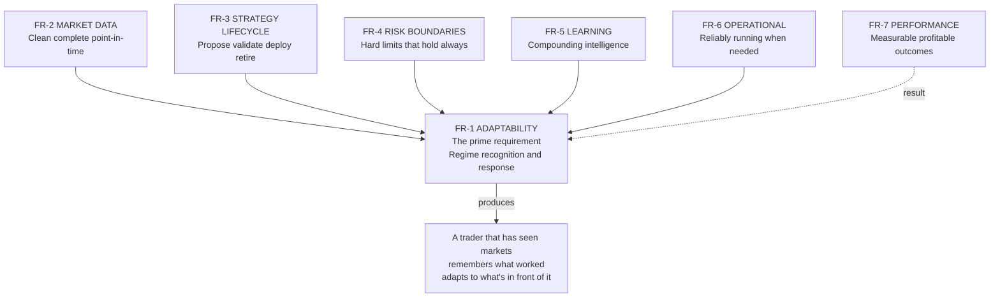

FR-1 is the goal. FR-2 through FR-6 are what make FR-1 achievable. FR-7 is how we measure whether FR-1 is actually working.

---
## 2. System Architecture Overview

```mermaid
graph TB
    subgraph REALTIME["REAL-TIME LAYER - Market Hours"]
        RT1[Alpaca News Websocket\nContinuous Stream]
        RT2[Polygon.io Market Feed\nPrice + Volume Live]
        RT3[Alpaca Markets Feed\nPrimary Data Source]
        RT4[NLP Classifier\nFast Path - under 2 seconds]
        RT5[News Shock Protocol\nCRITICAL Event Handler]
    end

    subgraph NEWS15["15-MINUTE NEWS CYCLE"]
        N1[Material News Synthesizer]
        N2[Sentiment State Updater]
        N3[Thesis Validator\nDoes news support open positions?]
        N4[Position Sizing Adjuster]
    end

    subgraph BRAIN["TWO-BRAIN AGENT LAYER"]
        B1[THE HUNTER\nFind edges\nHypothesize mutations\nDiscover new strategies\nMonitor edge decay]
        B2[THE GUARDIAN\nStress test everything\nAdversarial testing\nCrowding detection\nGate enforcement]
        B3[THE ARCHIVIST\nWeekly meta-learner\nLevel 3 principle extraction\nIntelligence synthesis]
    end

    subgraph REGIME["MULTI-LENS REGIME DETECTION"]
        R1[MACRO Lens\n3-18 months\nBull/Bear/Rate cycle]
        R2[MESO Lens\n2-8 weeks\nTrending/Ranging/Vol]
        R3[MICRO Lens\n1-5 days\nMomentum/Reversal signals]
        R4[Composite Market State\nAll three lenses combined]
    end

    subgraph LOOP["AUTORESEARCH LOOP - Three Tempos"]
        L1[MICRO LOOP\nIntraday monitoring\nNo strategy changes]
        L2[MACRO LOOP\nOvernight experiments\n4:30 PM to 9 AM]
        L3[DEEP LOOP\nSunday synthesis\nFull registry backtest]
    end

    subgraph REGISTRY["STRATEGY REGISTRY"]
        SR1[Active Strategies\nWeighted by regime fit]
        SR2[Standby Strategies\nReady to deploy]
        SR3[Edge Health Monitor\nDecay tracking per strategy]
        SR4[Experiment Log\nGit versioned]
    end

    subgraph EXECUTION["EXECUTION LAYER"]
        E1[Signal Generator]
        E2[Position Sizer\nKelly + ATR + Sentiment]
        E3[Risk Manager\nHard limits enforced]
        E4[Paper Trading Gate]
        E5[Live Broker - Alpaca\nPhase 4+]
    end

    subgraph KB["KNOWLEDGE BASE - ChromaDB"]
        K1[Level 1\nRaw experiment results]
        K2[Level 2\nExtracted patterns]
        K3[Level 3\nMeta-principles]
        K4[Regime History]
        K5[Macro Narratives\nWeekly web synthesis]
        K6[Edge Health Log]
    end

    subgraph LLM["LLM PROVIDERS"]
        LM1[Gemma 4 Local\nOllama - Primary]
        LM2[Gemini API\nGoogle]
        LM3[Claude API\nAnthropic]
        LM4[OpenAI API]
        LM5[OpenRouter\nMulti-model]
    end

    REALTIME --> NEWS15
    REALTIME --> BRAIN
    NEWS15 --> BRAIN
    BRAIN <--> REGIME
    BRAIN <--> LOOP
    BRAIN <--> KB
    BRAIN <--> LLM
    LOOP --> REGISTRY
    REGIME --> REGISTRY
    REGISTRY --> EXECUTION
    EXECUTION --> KB
```

---

## 3. The Two-Brain Architecture

The autoresearch loop is not a single agent. It is two agents in deliberate tension with each other, plus a third that synthesizes across both.

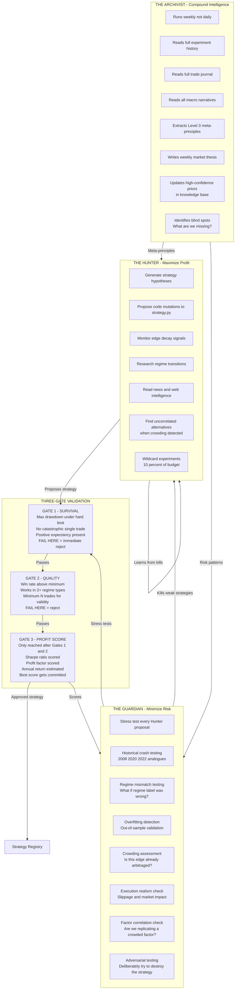

### Why Three Gates Instead of One Fitness Score

A weighted average fitness score can be gamed. A strategy with catastrophic tail risk but excellent average returns will score well on a weighted average. The gate structure makes this impossible:

**Gate 1 is a survival check, not a performance check.** A strategy that produces 50% annual returns but has one scenario where it loses 40% in a week fails Gate 1. Full stop. The Guardian runs this gate with adversarial intent — it is actively trying to find the scenario that kills the strategy.

**Gate 2 is a validity check.** A strategy that works on 12 trades in one regime type might be pure luck. Gate 2 requires statistical validity across multiple regime types.

**Gate 3 is where profit is scored.** Only strategies that have proven they won't blow up get to compete on returns. This means the system's profit-maximization drive operates within a safety envelope it cannot escape.

---

## 4. Multi-Timescale Regime Detection

The system tracks market regime at three different timescales simultaneously. Each drives a different layer of decision-making.

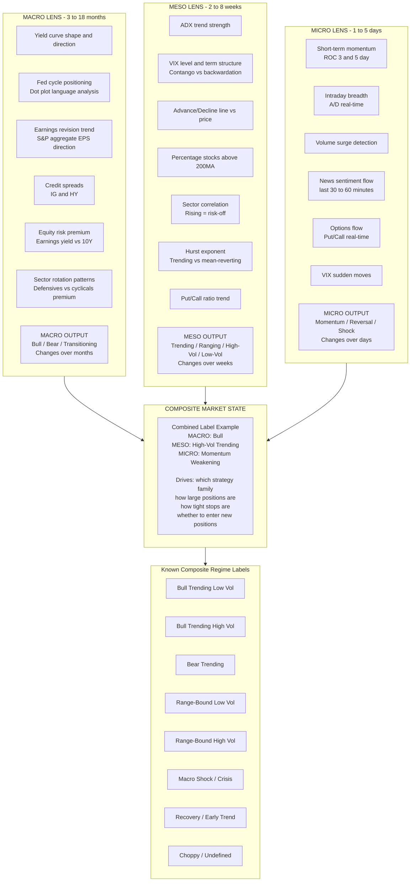

### How Each Lens Drives Decisions

| Lens | Drives | Update Frequency |
|------|--------|-----------------|
| **Macro** | Which sectors/styles to favor, long vs short bias, benchmark allocation | Weekly |
| **Meso** | Which strategy family to deploy from registry, base position sizing | Daily |
| **Micro** | Stop placement tightness, entry timing, whether to pause new entries | Every 15 minutes |

### Regime Confidence and the Uncertainty Response

Every regime label carries a **confidence score from 0.0 to 1.0.** This is not just a label — it governs position sizing across the whole portfolio:

```
Confidence > 0.80  → Full position sizing, normal operation
Confidence 0.60-0.80 → 75% of normal position sizes
Confidence 0.40-0.60 → 50% of normal position sizes, no new entries
Confidence < 0.40  → 25% sizing, close weakest positions, alert human
Regime transition signal → Halt new entries, protect open positions
```

This means **uncertainty itself becomes a risk-reduction mechanism.** When the market is unclear, Mahoraga automatically de-risks without being told to.

---

## 5. The Strategy Registry

Rather than one strategy, the system maintains a portfolio of strategies — each optimized for a specific regime combination. The autoresearch loop improves ALL of them continuously, not just the currently active one.

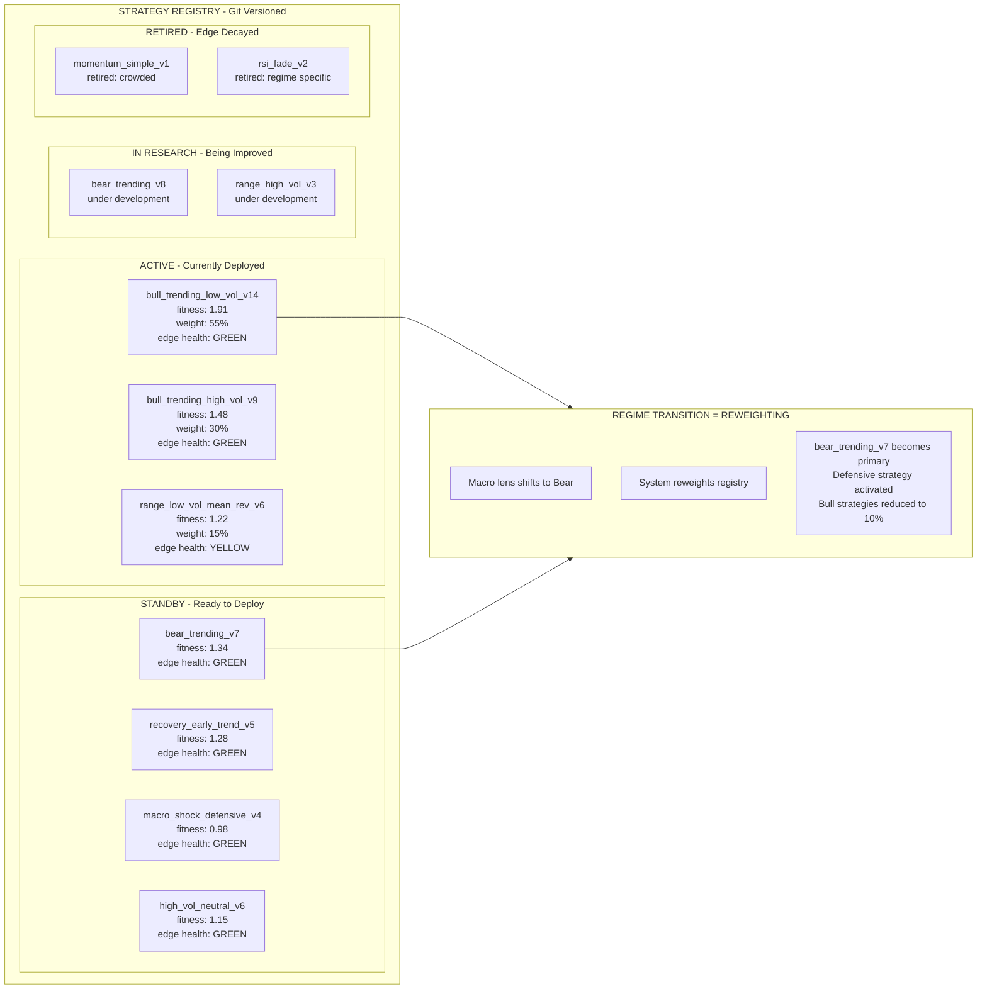

### Strategy Reweighting on Regime Transition

When a regime shift is detected, the system does not scramble to create a new strategy. It **reweights the existing registry** toward pre-prepared, pre-validated strategies for the new regime. The transition is smooth because the preparation was done in advance.

```
Regime shift detected: Bull Trending → Bear Trending

Before:
  bull_trending_low_vol_v14    weight: 55%  → reduces to 0%
  bull_trending_high_vol_v9    weight: 30%  → reduces to 0%
  range_low_vol_mean_rev_v6    weight: 15%  → reduces to 10%
  bear_trending_v7             weight: 0%   → increases to 70%
  macro_shock_defensive_v4     weight: 0%   → increases to 20%

Transition period (3-5 days):
  All new entries paused
  Existing positions managed to exits per their strategy rules
  New regime strategies begin taking positions as old ones clear
```

---

## 6. The Autoresearch Loop — Three Tempos

The system operates at three different rhythms. Each serves a distinct purpose.

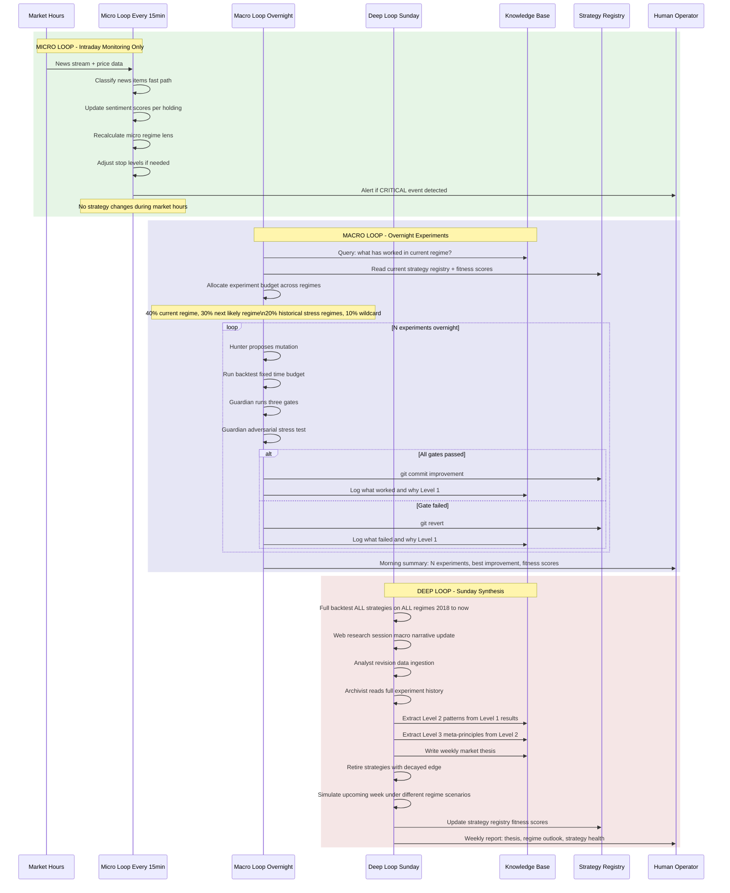

### Overnight Experiment Budget Allocation

This is one of the most important design decisions. The loop doesn't only improve today's strategy — it prepares for all futures.

```
Total overnight experiment budget: 100 experiments

40 experiments → Current regime strategy improvement
  Hunter finds mutations that improve performance NOW
  Guardian validates each one through all three gates

30 experiments → Most likely next regime preparation
  Based on macro lens signals and transition predictor
  If macro showing early bear signals: improve bear_trending strategies
  Guardian stress-tests against current regime in case transition doesn't happen

20 experiments → Historical stress regime hardening
  Run improvements against 2008 analogue, 2020 crash, 2022 bear market
  Any strategy that fails these stress tests gets flagged even if it passed Gate 1
  Ensures no strategy is optimized only for benign conditions

10 experiments → Wildcard discovery
  Hunter given maximum freedom
  Novel indicator combinations, entirely new entry logic
  Most will fail — but this is where tomorrow's primary strategy comes from
```

---

## 6.5 The Training Environment — Where Mahoraga Learns to Adapt

> This is the section that binds the whole system together. If you understand this section, you understand Mahoraga.

The autoresearch loop, the knowledge base, the strategy registry, the three-gate system — these are all machinery. The *training environment* is where that machinery actually converges Mahoraga into a trader that has seen enough markets to know what works.

---

### The Core Insight

Mahoraga does not learn at calendar speed. A trader who wants to see "10 years of markets" must wait 10 years. A system with a faithful simulation of historical markets can see those same 10 years in weeks of wall-clock time — experiencing each day sequentially, making decisions bar-by-bar, observing outcomes, updating the library.

This means **Day 1 of live trading is not Day 1 of learning.** It is Year N+1, where N is the number of years of historical market the system has lived through in simulation. If Mahoraga has faithfully lived through 2018-2025, then live trading is Year 9 of its experience — and the library is already populated with battle-tested responses to regimes it has personally navigated.

---

### The Requirement: Faithful Simulation

The training environment must provide, at every simulated bar, the exact data that would have been available live at that moment. No more, no less.

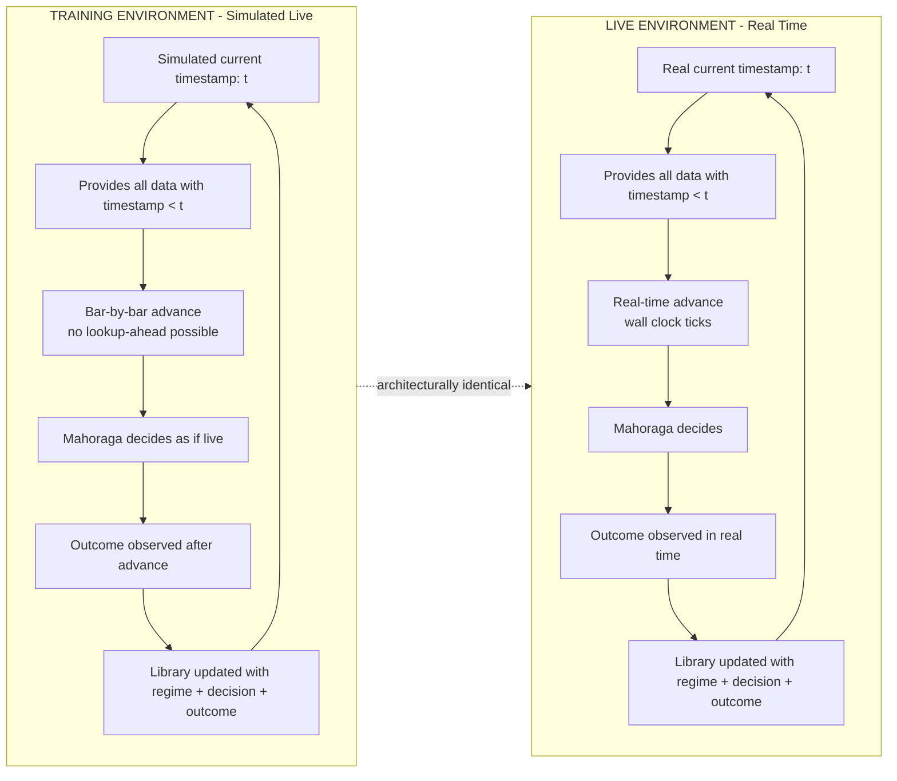

**The training and live environments must be architecturally identical** — same feature calculations, same regime detection, same strategy selection, same risk checks, same library update path. The only differences are:

| Dimension | Training | Live |
|-----------|----------|------|
| Clock | Simulated, advances at chosen speed | Real wall-clock, ~390 minutes per session |
| Data source | Historical archive, served bar-by-bar | Live feeds (Alpaca, Polygon) |
| Execution | Simulated fills with realistic slippage | Real broker fills |
| News | Historical news archive if available, price-action proxy otherwise | Real-time news stream |
| Wall-clock cost of 1 year of market | ~1 week | 1 year |

---

### What Gets Simulated Faithfully (Critical)

Every dimension of the live environment must have a training equivalent. Any gap is a way the library won't generalize.

**Price action** — OHLCV bars delivered in chronological order, one at a time. The system never sees bar t+1 data when making a decision at time t.

**Volume and liquidity** — Accurately represented so slippage modeling works. Average volume, volume at time of day, volume relative to 20-day average — all must be point-in-time.

**Corporate actions** — Splits, dividends, spin-offs, bankruptcies applied on their actual historical dates. A backtest that ignores these produces a fantasy world.

**Point-in-time universe** — The S&P 500 on 2019-03-15 contained specific companies. Some are gone now. The training must use the 2019-03-15 membership, not today's.

**Fundamental data as it was known then** — Earnings estimates existed before earnings were announced. Analyst ratings were revised over time. Training must use the estimates that existed at each timestamp, not the revised ones we have today. This is harder than it sounds — most data providers give you the final revised values, not the point-in-time snapshot.

**Macro data with release lags** — GDP, CPI, unemployment: these are released with delays. The training must respect when data was actually *public*, not the period it covers. CPI for January is released in mid-February — it must appear in the training environment only after its release date.

**Realistic execution** — Orders don't fill at the exact signal price. Slippage, market impact, partial fills, rejections must all be simulated. See Section 21 for the full execution model.

**Trading calendar accuracy** — Market holidays, early closes, half-days. The system must not "trade" on days the market was closed.

---

### What Gets Approximated (Acknowledged Limitations)

Some things cannot be perfectly simulated. We acknowledge the gap honestly and design around it.

**Historical news text** — Alpaca's news archive goes back ~5 years. Before that, we have only partial coverage. The solution:
- Use news where we have it
- Use **price-action proxies** for news impact where we don't (large gaps + volume spikes indicate news occurred, even without the text)
- Train news-aware strategies only on periods where news data exists
- Train news-agnostic strategies on the full historical range

**Market microstructure** — Bid/ask spreads, order book depth, dark pool activity — these are difficult to reconstruct historically at fine granularity. We use wider slippage assumptions to compensate (treating all historical execution as worse than it probably was, which is the safe direction for error).

**Real-time sentiment data** — Social media sentiment, retail flow indicators, options flow — these have limited historical coverage. Strategies depending on these must accept that they have less training data than price-based strategies.

**Regulatory changes** — The PDT rule, SSR, circuit breaker thresholds have evolved. The training environment applies the rules as they existed at each historical date, not today's rules.

---

### The Training Protocol

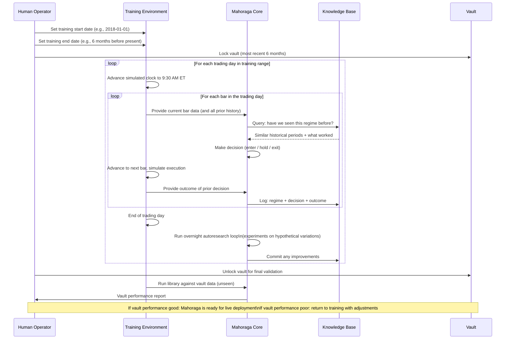

---

### The Compressed Learning Schedule

A reasonable training schedule on a MacBook Pro with the described stack:

| Stage | Training Range | Wall-Clock Time | What Emerges |
|-------|----------------|-----------------|--------------|
| Stage 1 | 2018 full year | ~3-4 days | First regime library entries (Q4 2018 shock, mild bull) |
| Stage 2 | 2019 full year | ~3-4 days | Bull trending low-vol library deepens |
| Stage 3 | 2020 full year | ~5-7 days | Crash + recovery library (the most valuable training period) |
| Stage 4 | 2021 full year | ~3-4 days | High-vol bull + meme conditions |
| Stage 5 | 2022 full year | ~3-4 days | Bear market + rate shock library |
| Stage 6 | 2023 full year | ~3-4 days | AI-driven bull trend |
| Stage 7 | 2024 full year | ~3-4 days | Recent conditions |
| Stage 8 | 2025 up to vault boundary | ~2-3 days | Most recent pre-vault period |
| Stage 9 | Vault validation | ~1 day | Final proof library generalizes |

Total: roughly 4-6 weeks of wall-clock to produce a library informed by 7+ years of market experience. Compare to living through those same years in real time: 7 years.

After training, Mahoraga begins live trading with:
- Thousands of Level 1 experiment entries
- Dozens of Level 2 patterns
- Several Level 3 meta-principles
- A strategy registry with entries for every major regime type
- Vault-validated evidence that the library generalizes to unseen data

---

### Library Versioning — How We Know Training Is Working

Each stage of training produces a new library version. These are versioned like models:

```
library_v0    Empty, seed strategies only
library_v1    After Stage 1 (2018 training)
library_v2    After Stage 2 (2018-2019)
library_v3    After Stage 3 (2018-2020, includes crash experience)
...
library_v8    Pre-vault, trained on 2018-2025-minus-vault
library_v8_validated    Passed vault validation, ready for live
```

For each version transition, we measure:
- **Vault performance** — held-out 6 months never seen during training
- **Known-regime performance** — on historical periods the prior version also saw
- **Complexity** — parameter count, strategy count, filter count

**Convergence signals:**
- Vault performance improves monotonically or plateaus
- Known-regime performance stays stable (no catastrophic forgetting)
- Complexity grows slower than performance (strategies get smarter, not just bigger)

**Divergence signals (training is going wrong):**
- Vault performance peaks at an intermediate version and then degrades → overfitting
- Known-regime performance degrades as new data is added → catastrophic forgetting
- Complexity explodes without corresponding performance gains → agent is grasping

If divergence is detected, we rollback to the last good version and adjust training parameters.

---

### The Continuity Between Training and Live

This is the elegant part: **there is no "switch-over" moment between training and live.** The training loop *is* the live loop, running on historical data instead of real-time data. When we deploy:

1. The training loop processes its last historical bar
2. The training environment seamlessly hands off to the live environment
3. The first live bar arrives and is processed identically to how the last historical bar was processed
4. The library, already populated, immediately provides relevant precedents for the live regime
5. Every live day adds one more entry to the library — refinement, not construction

The live loop is not a different system. It's the training loop with the clock set to "now" and the data source set to "live."

This architectural choice has a profound implication: **every bug or inefficiency in live is also present in training.** We can find and fix these during training without risking capital. By the time we go live, the entire machinery has processed tens of thousands of bars successfully.

---

### The Convergence Contract

At the end of training, before live deployment, we produce a **Convergence Report** that honestly answers:

- How many trading days did Mahoraga experience in training?
- How many distinct regimes did it encounter?
- What is the library size (Level 1 entries, Level 2 patterns, Level 3 principles)?
- What is the vault validation performance?
- For each known regime type: does the library have a validated response?
- For what percentage of historical days would Mahoraga have made a recognizable decision?
- What is the worst historical day for the library? What would have happened?

This report is delivered to the human operator. Live deployment requires explicit human approval after reviewing the report. If any answer is unsatisfactory, we return to training rather than deploy.

---

### Why This Is the Heart of the System

Most algorithmic trading systems are built on "backtesting then deploying." Mahoraga is built on **simulated experience then continued experience.** The distinction matters:

- Backtesting says: *"Does this strategy work on historical data?"*
- Simulated experience says: *"Has this system lived through historical markets, formed memories, and learned what to do?"*

A backtested strategy answers a question. A trained Mahoraga is a *trader* — one that has seen 2020's crash, Q4 2018's shock, 2022's rate regime — not as data, but as **experiences it made decisions during.** That is what convergence means. That is what makes this different from every other autoresearch setup.

When the market enters a condition Mahoraga has seen before, the response is not calculated from first principles. It is **remembered** — queried from the library, weighted by similarity, refined by recent outcomes, and executed. That is the Mahoraga who never gets caught off guard by the same thing twice.

---
## 7. The Preparation Engine

This is what separates Mahoraga from a reactive system. The preparation engine ensures the system has studied, backtested, and stress-tested every known regime type before that regime arrives.

```mermaid
graph TB
    subgraph PREP["PREPARATION ENGINE"]
        subgraph SIGNALS["Regime Transition Early Warning"]
            S1[Yield curve slope trend]
            S2[VIX term structure shift\nContango to backwardation]
            S3[Credit spread widening trend]
            S4[Breadth deterioration vs price]
            S5[Sector rotation: defensives premium rising]
            S6[Earnings revision trend turning]
            S7[News narrative shift detection]
            S8[Analyst consensus direction change]
        end

        subgraph PREDICTOR["Transition Probability Engine"]
            TP1[Rules-based layer\nOption A: hard-coded triggers\nalways running]
            TP2[Hunter-learned layer\nOption B: LLM learns precursors\nfrom regime history]
            TP3[Combined output\nNext regime probabilities\nBull 20% Bear 60% Range 20%]
        end

        subgraph ALLOCATION["Experiment Budget Allocation"]
            EA1[If Bear probability > 40%\nadd 10% more experiments to bear prep]
            EA2[If shock probability rising\nadd experiments to defensive strategy]
            EA3[If current regime > 8 weeks\nstart preparing for any transition]
        end

        subgraph SCENARIOS["Weekly Scenario Simulation"]
            WS1[Scenario A: Regime continues\nhow does current strategy perform?]
            WS2[Scenario B: Regime shifts to next most likely\nhow fast can we transition?]
            WS3[Scenario C: Black swan shock\nhow much do we lose before defensive activates?]
            WS4[Human receives scenario report every Sunday]
        end
    end

    SIGNALS --> PREDICTOR
    PREDICTOR --> ALLOCATION
    ALLOCATION --> SCENARIOS
```

### The Two-Layer Transition Predictor

**Layer 1 — Rules-based (always active from day one):**

Defined triggers that the Hunter cannot override. These are hardcoded because they are historically reliable:
- Yield curve inverts AND VIX rises 3 consecutive days AND breadth deteriorates → Bear transition imminent, 70% weight
- VIX term structure shifts from contango to backwardation → Volatility regime shift, 80% weight
- Credit spreads widen >50bps in 2 weeks → Risk-off shift, 65% weight
- Fed language shifts from neutral to hawkish → Rate shock risk, 60% weight

**Layer 2 — Hunter-learned (emerges from knowledge base):**

Over time, as the system accumulates regime transitions in its history, the Hunter begins forming its own hypotheses about precursor signals. It queries the knowledge base: "What market conditions appeared in the 60 days before every bear market transition we have data on?" It extracts patterns and adds them as learned transition signals. This layer gets stronger every year.

---

## 8. Real-Time News Architecture

News is a first-class real-time signal. Markets react to news in seconds. Mahoraga runs a continuous news stream during market hours and processes it at three speeds.

```mermaid
graph TB
    subgraph SOURCES["NEWS SOURCES"]
        NS1[Alpaca News Websocket\nPrimary - included with account]
        NS2[Benzinga Pro API\nFaster - better pre-classification]
        NS3[Federal Reserve RSS\nDirect source - FOMC and speeches]
        NS4[SEC EDGAR Real-time\n8-K filings as they drop]
        NS5[Polygon News Stream\nSecondary + validation]
    end

    subgraph INGESTION["NEWS INGESTION ENGINE"]
        NI1[Websocket connection manager\nReconnects on drop]
        NI2[Deduplication layer\nsame story multiple sources]
        NI3[Timestamp normalization\nET timezone enforced]
    end

    subgraph FAST["FAST PATH - Every item - under 2 seconds"]
        FP1[Relevance filter\nDoes this affect any open position\nor watchlist stock or current regime?]
        FP2[Impact scoring\nBreadth: one stock sector or market wide\nDirection: bullish bearish ambiguous]
        FP3[Urgency classification\nCRITICAL / MATERIAL / BACKGROUND]
        FP4[Small local NLP model\nor rule-based classifier\nNO full LLM call here]
    end

    subgraph CRITICAL["CRITICAL EVENT HANDLER - News Shock Protocol"]
        CE1[T+0sec: CRITICAL classified]
        CE2[T+1sec: HALT all new entries minimum 10 minutes]
        CE3[T+2sec: Check all open positions vs news direction\nHarmed positions: tighten stops\nHelped positions: hold do not chase]
        CE4["T+5sec: Telegram alert to human\nCRITICAL: headline\nAffected: positions\nAction: stops tightened entries halted\nRegime confidence: X%\nAwaiting your input"]
        CE5[T+2min: Secondary analysis\nIs this regime change or one-off shock?\nVIX spike confirms?\nBreadth spreading beyond initial sector?]
        CE6[T+10min: Decision point\nRegime unchanged: resume\nTransition signal: defensive mode\nHuman override: follow instruction]
        CE7[Note: 10-minute pause before forced exits\nMarkets often reverse on initial shock\nTighter stops protect without premature exit]
    end

    subgraph MEDIUM["MEDIUM PATH - Every 15 minutes - 30 seconds"]
        MP1[Pull all MATERIAL news from last 15 minutes]
        MP2[Gemma 4 local inference\nSynthesize material items]
        MP3[Per affected stock: does news support or contradict thesis?]
        MP4[Update sentiment score per ticker]
        MP5[Update market-wide sentiment aggregate]
        MP6[Cross-reference with current regime lens\nNews confirming regime: high confidence hold\nNews contradicting regime: reduce sizing wait for clarity]
        MP7[Adjust position sizes and stops based on updated state]
        MP8[Log all updates to knowledge base with timestamp]
        MP9[One LLM call per 15-minute cycle]
    end

    subgraph SENTIMENT["CONTINUOUS SENTIMENT STATE"]
        SS1[Per stock sentiment score\nWeighted rolling average\nLast 24h: 40%\nLast 7d: 30%\nLast 30d: 20%\nAnalyst revision momentum: 10%\nRange: -1.0 to +1.0]
        SS2[Market-wide sentiment state\nVIX level and direction\nNews flow positive/negative ratio last 30 min\nBreadth readings\nUpdated every 15 minutes]
        SS3[Sentiment feeds into:\nPosition sizing: lower sentiment = smaller size\nStop placement: negative sentiment = tighter stop\nEntry filters: no new long if market sentiment below -0.3]
    end

    SOURCES --> INGESTION
    INGESTION --> FAST
    FAST -->|CRITICAL| CRITICAL
    FAST -->|MATERIAL| MEDIUM
    FAST -->|BACKGROUND| BG[Log for weekly synthesis]
    MEDIUM --> SENTIMENT
```

### What CRITICAL vs MATERIAL vs BACKGROUND Means

| Classification | Examples | Response |
|----------------|----------|----------|
| **CRITICAL** | Fed surprise, CPI/NFP miss beat >0.3% vs estimate, earnings surprise >10% on held position, geopolitical shock, trading halt | Halt entries, tighten stops, alert human immediately |
| **MATERIAL** | Analyst upgrade/downgrade on held stocks, sector news, drug approval, litigation update, macro data in-line with nuance | Update sentiment scores, flag if thesis changes, review within 15 min |
| **BACKGROUND** | General market commentary, far-future guidance, geopolitical noise without direct impact | Log for weekly synthesis |

---

### FED WATCH MODULE *(noted — deep dive in a future phase)*

The Federal Reserve is the single most powerful market mover. Both actual Fed decisions AND the market's *expectations* of those decisions move prices significantly — often the expectation move is larger than the actual announcement itself.

**What this module needs to track:**

- **Fed Funds Futures / CME FedWatch probabilities** — The market's live probability of a rate hike, hold, or cut at each upcoming meeting. When this shifts materially (e.g. cut probability drops from 70% to 30% in a week), it is a macro regime signal.
- **FOMC Meeting Calendar** — All scheduled dates pre-loaded. Automatic entry halt 30 minutes before and after any announcement (already covered in hard limits).
- **Fed Speaker Monitoring** — Governors and regional presidents speak constantly between meetings. Their language often signals the next move before it is official. Chair, Vice Chair, and known hawks/doves on the committee are highest priority.
- **Dot Plot Tracking** — Released quarterly. Each dot plot shift is a multi-month regime signal, especially for rates-sensitive sectors: financials, real estate, utilities, and growth/tech stocks.
- **Inflation Expectations** — 5Y5Y breakeven inflation rate and TIPS spreads. When the Fed's 2% target looks threatened, policy shifts follow. This leads rates moves by weeks.
- **Language Drift NLP** — Compare FOMC statement language meeting-over-meeting. The progression from "patient" → "vigilant" → "restrictive" is a directional signal even before rates move. Historical statements going back to 2015 provide training data.

**Free data sources for this module:**
- Federal Reserve RSS feed — speeches and statements as they publish (already in news stream)
- CME Group FedWatch Tool — rate probability data, free via API
- FRED API (St. Louis Fed) — breakevens, TIPS spreads, fed funds rate history, free

**How it integrates in the interim (before the deep dive):**
- FOMC meeting dates pre-loaded into economic calendar → automatic 30-min entry halt already enforced
- Fed RSS feed already in the continuous news stream → FOMC statements auto-classified as CRITICAL
- FedWatch probability data pulled in the Sunday deep research session → feeds into macro narrative and transition predictor

*Full module design — including real-time FedWatch probability monitoring, meeting-over-meeting language drift NLP, dot plot impact modelling, and rates-sector correlation mapping — to be designed and built as a dedicated future phase.*

---

### The 10-Minute Rule for Shock Events

A system that immediately exits all positions on scary headlines will consistently get stopped out right before reversals. The 10-minute pause is deliberate:

- Stops get tightened immediately → protection is in place
- New entries halt immediately → no new risk added
- But forced exits wait 10 minutes → gives market time to digest
- In most cases, the dust settles and positions are fine with tighter stops
- In cases where it doesn't settle, tighter stops protect anyway
- This mimics how experienced traders handle news shocks

---

## 9. The Transition Predictor — Full Signal Stack

The transition predictor combines technical signals, fundamental signals, news intelligence, and analyst data to form a probabilistic view of where the regime is going.

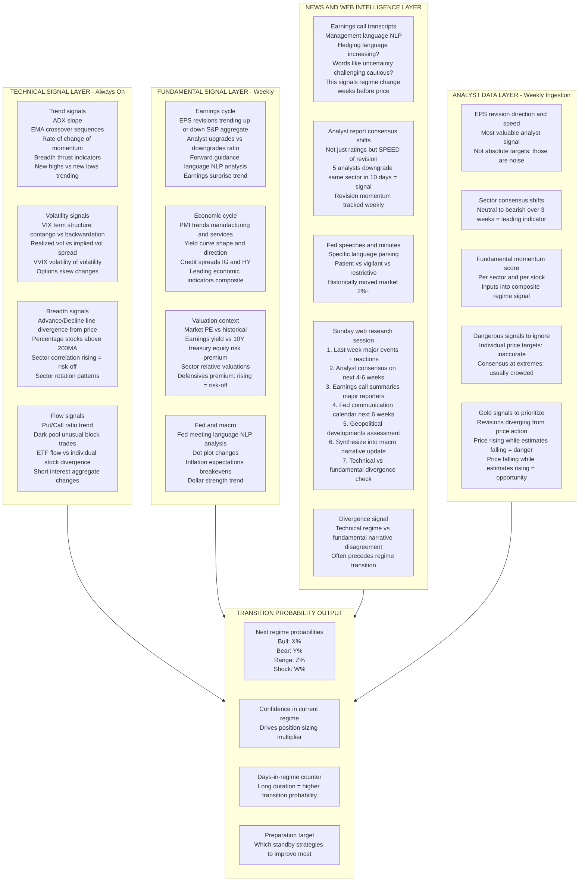

---

## 10. Adversarial Edge Management

Markets are adversarial. Every edge found will eventually be arbitraged away. The system monitors its own edge health continuously and proactively develops replacements before decay becomes loss.

```mermaid
graph TB
    subgraph ADVERSARIES["THREE ADVERSARIES TO MANAGE"]
        ADV1[HIGH FREQUENCY TRADERS\nSee your order flow\nFront-run predictable entry patterns\nEdge shows as widening slippage\nDefense: vary entry timing\nuse limit orders\nnever predictable in execution]
        ADV2[INSTITUTIONAL CROWDING\nWhen a factor becomes widely known\ninstitutions pile in\nFactor works until catastrophic exit\nAll exit simultaneously: violent crash\nDefense: crowding signals\nreduce when strategy is consensus]
        ADV3[REGIME EXPLOITATION\nSophisticated players create false regime signals\nLarge institution accumulates: brief downtrend\nShakes out weak hands then reverses\nDefense: multi-timeframe confirmation\nnever act on single signals]
    end

    subgraph EDGE_MONITOR["EDGE HALF-LIFE MONITOR - Per Strategy, Weekly"]
        EM1[Rolling 4-week Sharpe vs all-time Sharpe\nDegradation signal if declining]
        EM2[Slippage trend\nWidening = crowding signal]
        EM3[Win rate trend\nDeclining = edge erosion]
        EM4[Correlation to factor ETFs\nMomentum ETF Quality ETF etc\nRising = crowding signal]
        EM5[Out-of-sample vs in-sample gap\nWidening = overfitting developing]

        subgraph ALERTS["Alert Thresholds"]
            AL1[2 signals trigger simultaneously\nGuardian elevated alert\nHunter tasked: find replacement\nPosition sizing reduced 50%\nHuman notification sent]
            AL2[3 or more signals trigger\nStrategy suspended from live trading\nMoved to monitoring-only mode\nReplacement required before reactivation]
        end
    end

    subgraph CROWDING["CROWDING DETECTION MODULE"]
        CD1[Check before any strategy promotion]
        CD2[Strategy returns strong 2yr ago declining recently\nsame regime conditions = crowding signal]
        CD3[Correlation to known factor ETFs rising]
        CD4[Short interest in positions declining\nfewer people on other side = less edge]
        CD5[Volume at typical entry points unusually high\nothers entering same way]
        CD6[Slippage on paper trades widening vs historical]
        CD7[If crowding detected:\nHunter tasked to find uncorrelated variant\nsame thesis different implementation\ndifferent timing different universe subset]
    end

    subgraph EDGE_RENEWAL["EDGE RENEWAL CYCLE"]
        ER1[10% wildcard experiment budget every night]
        ER2[Hunter finds novel ideas before needed]
        ER3[Guardian validates new edges rigorously]
        ER4[New edges move to standby registry]
        ER5[Ready to promote before current edge fully decays]
        ER6[The renewal cycle never stops\neven when current strategies are performing well]
    end

    subgraph DIFF["EDGE DIFFERENTIATION - The Long-Term Defense"]
        ED1[Year 1: single signal edges]
        ED2[Year 2: multi-signal synthesis edges]
        ED3[Year 3+: regime + fundamental + sentiment + technical\nsynthesis edges that no single player can replicate]
        ED4[Compound signal is much harder to arbitrage away]
        ED5[This is the hedge fund moat]
    end

    ADVERSARIES --> EDGE_MONITOR
    EDGE_MONITOR --> CROWDING
    CROWDING --> EDGE_RENEWAL
    EDGE_RENEWAL --> DIFF
```

### Alpha Decay Half-Life by Strategy Type

Understanding typical decay rates helps the Hunter prioritize replacement research:

| Strategy Type | Typical Half-Life | Why |
|---------------|-------------------|-----|
| Simple momentum breakout | 6-18 months | Widely known, easily crowded |
| RSI mean reversion | 12-24 months | Requires specific vol regime, moderately crowded |
| Multi-factor composite | 24-48 months | Harder to replicate, less crowded |
| Regime-conditional composite | 36-60 months | Requires regime detection infrastructure, hard to crowd |
| News + technical synthesis | Unknown, likely long | Requires both NLP and quant infrastructure, very hard to crowd |

The implication: the system should continuously evolve toward more complex, harder-to-replicate composite edges. This is what the Archivist's Level 3 principles push toward over time.

---

## 11. The Knowledge Base — Three Levels

The knowledge base is what makes Mahoraga's intelligence compound rather than just accumulate. It is structured in three levels of abstraction, each more powerful than the last.

```mermaid
graph TB
    subgraph L1["LEVEL 1 - Raw Experiment Results"]
        L1A[Every backtest result ever run]
        L1B[Format: Experiment ID, mutation description,\nregime at time of test, all fitness metrics,\nGuardian test results, commit or revert, timestamp]
        L1C[Example: Experiment 247: increased RSI lookback 14 to 21\nBull Trending Low Vol: fitness improved +0.12\nBear Trending: fitness degraded -0.08\nNet: committed for Bull regime only]
        L1D[Never deleted. Permanent record.]
        L1E[Queried by Hunter before every hypothesis\nto avoid re-testing known failures]
    end

    subgraph L2["LEVEL 2 - Extracted Patterns"]
        L2A[LLM extracts from Level 1 over time]
        L2B[Patterns that appear across multiple experiments]
        L2C[Example: Longer lookback periods consistently outperform\nin low-volatility trending regimes.\nShorter lookbacks outperform in choppy high-vol regimes.]
        L2D[Example: Volume confirmation filters improve win rate\nin all regime types at cost of trade frequency]
        L2E[Extracted weekly by Archivist]
        L2F[Used by Hunter to generate higher-quality hypotheses]
    end

    subgraph L3["LEVEL 3 - Meta-Principles"]
        L3A[Emerge after hundreds of experiments]
        L3B[Highest confidence priors in the system]
        L3C[Example: Mean reversion strategies fail catastrophically\nin first 3 weeks of a new trending regime.\nAlways include trend-strength circuit breaker.]
        L3D[Example: Strategies optimized only on 2019-2021 data\nfail violently in vol spikes. Always stress-test on 2020 crash.]
        L3E[Example: When VIX term structure inverts\nreduce all position sizes by 50% regardless of strategy signal.]
        L3F[Extracted monthly by Archivist from Level 2 patterns]
        L3G[These principles are treated as near-inviolable constraints\nnot just suggestions]
    end

    subgraph SUPPORTING["SUPPORTING KNOWLEDGE STORES"]
        SK1[Regime History\nEvery regime label with timestamp\nwhat strategies were active\nhow they performed]
        SK2[Macro Narratives\nWeekly web research synthesis\nFed language analysis\nearnings call summaries]
        SK3[Edge Health Log\nPer-strategy decay tracking over time]
        SK4[Trade Journal\nEvery paper and live trade\nentry exit price regime at time\nsentiment score at time]
        SK5[Transition History\nEvery regime transition observed\nwhat preceded it\nhow long it took]
    end

    L1 -->|Archivist weekly| L2
    L2 -->|Archivist monthly| L3
    L3 -->|High-confidence priors| HUNTER[Hunter uses before every hypothesis]
    L3 -->|Inviolable constraints| GUARDIAN[Guardian enforces as additional gate]
    SUPPORTING --> L2
    SUPPORTING --> L3
```

---

## 12. Data Architecture

### The Two Core Market Data Sources

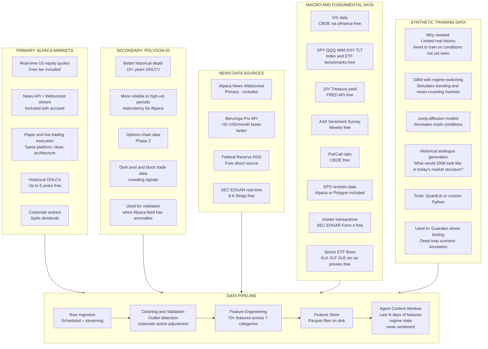

### Required Historical Data Coverage

The system must train on every major regime type in recent history:

| Period | Regime Type | Why Essential |
|--------|-------------|---------------|
| 2018 Q4 | Sudden bear / vol spike | Tests crash response |
| 2019 full year | Bull trending low vol | Tests momentum strategies |
| 2020 Feb-Mar | Black swan crash | Extreme Guardian stress test |
| 2020 Apr-Dec | V-shape recovery | Tests recovery phase detection |
| 2021 full year | Meme stock / high vol bull | Tests unusual bull conditions |
| 2022 full year | Bear trending / rate shock | Tests bear strategies |
| 2023-2024 | AI-driven bull trend | Tests sustained momentum |
| 2025-2026 | Current conditions | Live validation |

### Feature Engineering — 70+ Features Across 7 Categories

| Category | Features |
|----------|----------|
| **Trend** | EMA 20/50/200, EMA slope, ADX, MACD signal and histogram, linear regression slope, price vs MA deviation |
| **Momentum** | RSI 14 and 21, Rate of Change 3/5/10/20, Stochastic %K and %D, Williams %R, momentum oscillator |
| **Volatility** | ATR 14, Bollinger Band width and %B, realized vol 10/20/30 day, VIX ratio, historical vol percentile |
| **Volume** | OBV, volume ratio vs 20D avg, VWAP deviation, relative volume, accumulation/distribution, MFI |
| **Statistical** | Hurst exponent, Z-score vs 20/50 day mean, autocorrelation, skewness 30 day, kurtosis 30 day |
| **Macro** | VIX regime bucket, yield curve slope, DXY trend, SPY and QQQ relative strength, sector ETF momentum |
| **Sentiment** | News sentiment score 24h and 7d rolling, analyst revision momentum, insider transaction signal |

---

## 13. LLM Provider Architecture

The system is designed to work with any LLM provider via a unified interface. Speed vs depth is matched to the right model for each task.

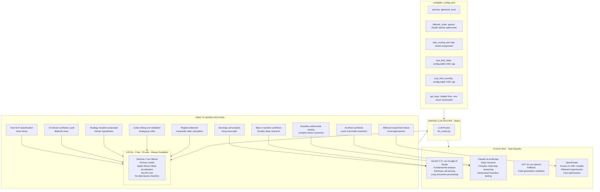

### Speed vs Depth Matrix

| Task | Speed Required | Model | Frequency |
|------|---------------|-------|-----------|
| News classification | Under 2 seconds | Small local or rules | Continuous |
| 15-min news synthesis | Under 30 seconds | Gemma 4 local | Every 15 min |
| Regime lens calculation | Under 10 seconds | Gemma 4 local | Every 15 min |
| Hunter hypothesis | 1-2 minutes | Gemma 4 local | Per experiment |
| Strategy code mutation | 2-5 minutes | Gemma 4 local | Per experiment |
| Guardian stress test | 5-10 minutes | Gemma 4 or Claude | Per experiment |
| Earnings call analysis | 10-20 minutes | Gemini | Weekly |
| Macro narrative synthesis | 20-40 minutes | Gemini + web search | Weekly |
| Archivist extraction | 30-60 minutes | Claude | Weekly |

---

## 14. Deployment Architecture — MacBook Pro

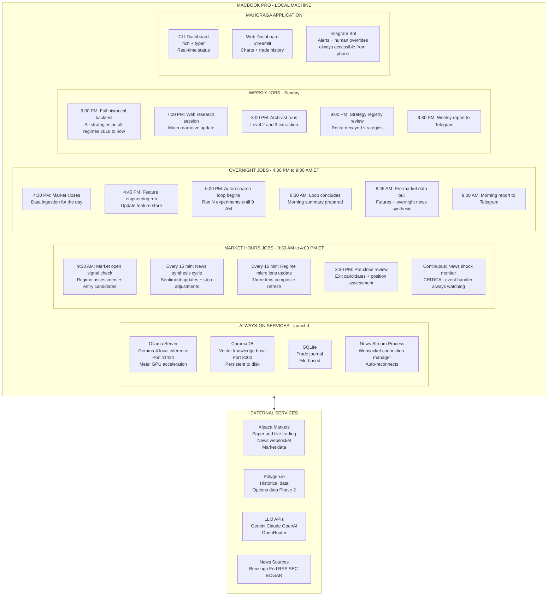

### MacBook Pro Operational Details

| Concern | Solution |
|---------|----------|
| Gemma 4 inference speed | Ollama with Metal GPU — Apple Silicon is well-suited |
| Running overnight without sleep | `caffeinate -i` wrapper on research loop process |
| Memory limits | Gemma 4 at 4-bit quantization: ~8GB VRAM, fits in 16GB or 32GB RAM |
| Power during research loop | Script checks for AC power before starting; warns if on battery |
| Data storage growth | ~5GB per year for full US equity daily OHLCV, ~20GB with intraday |
| Time zone management | All schedulers use ET (America/New_York) explicitly |
| Process crash recovery | launchd restarts crashed processes automatically |
| News websocket drops | Connection manager with exponential backoff reconnection |

### Three Environments — Dev, Staging, Prod

```
DEV ENVIRONMENT
  Historical data only
  No real money ever
  Agent experiments freely
  Fast 5-minute backtests
  Maximum iteration speed

STAGING ENVIRONMENT
  Paper trading on live market data
  Real prices, real timing, zero dollars
  Catches what backtests miss: slippage, timing, news impact
  Minimum 30 days before promotion to Prod

PROD ENVIRONMENT
  Live trading, real money
  Hard limits enforced at infrastructure level
  Human review required for any limit changes
  Starts with small capital, scales as confidence builds
```

---

## 15. Risk Management Framework

```mermaid
graph TB
    subgraph HARD["HARD LIMITS - Agent Cannot Override - Enforced at Infrastructure Level"]
        H1[Max single position: 5% of portfolio]
        H2[Max sector exposure: 20% of portfolio]
        H3[Max correlation between positions: checked before every entry]
        H4[Daily loss limit: 2% of portfolio triggers trading halt]
        H5[Weekly loss limit: 5% of portfolio triggers human review]
        H6[Stop-loss on every trade: max 2x ATR from entry]
        H7[No trading 30 minutes around FOMC CPI NFP major events]
        H8[No new entries when regime confidence below 40%]
        H9[Position sizing scales with regime confidence]
    end

    subgraph SOFT["SOFT LIMITS - Agent Can Adjust Within Range"]
        S1[Position size: 1% to 5% of portfolio\ndefault 2%]
        S2[Hold duration: 1 day to 6 weeks\nbased on strategy and regime]
        S3[Number of open positions: 5 to 20\nbased on regime clarity]
        S4[Profit target: 1.5x to 3x risk\nbased on strategy type]
        S5[Stop tightening: allowed when negative news or regime uncertainty]
    end

    subgraph SIZING["DYNAMIC POSITION SIZING"]
        PS1[Base size from Kelly Criterion\nfractional: 25% of full Kelly]
        PS2[ATR adjustment\nrisk per trade = 1% of portfolio divided by ATR]
        PS3[Regime confidence multiplier\n0.4 confidence = 0.5x size multiplier]
        PS4[Sentiment adjustment\nstock sentiment below -0.3 = reduce size 30%]
        PS5[Market sentiment adjustment\nmarket sentiment below -0.3 = no new longs]
        PS6[Edge health adjustment\nYELLOW flag = 50% size\nRED flag = no new entries]
        PS7[Final position size = base x regime x sentiment x edge health]
    end

    subgraph GATE_PROMO["PAPER TO LIVE PROMOTION GATES"]
        PG1[Minimum 30 calendar days paper trading]
        PG2[Minimum 50 completed trades]
        PG3[Sharpe ratio above 1.0 on out-of-sample period]
        PG4[Max drawdown below 15% on paper]
        PG5[Win rate above 45% with positive expectancy]
        PG6[No single catastrophic trade above 5% loss]
        PG7[Performance in at least 2 different regime types]
        PG8[Human explicitly approves promotion]
    end

    subgraph MONITOR["CONTINUOUS MONITORING"]
        M1[Real-time P&L tracking per position]
        M2[Portfolio drawdown alert at 1.5% daily: warning]
        M3[Portfolio drawdown at 2% daily: halt new entries]
        M4[Sector correlation check before every new entry]
        M5[Regime change alert: review all open positions]
        M6[Weekly performance vs SPY benchmark]
        M7[Monthly Sharpe trend: is it degrading?]
    end

    HARD --> SIZING
    SOFT --> SIZING
    SIZING --> GATE_PROMO
    GATE_PROMO --> MONITOR
```

---

## 16. Build Phases & Roadmap

### Priority: Autoresearch Loop First

The autoresearch loop is the brain of Mahoraga. Until it works well, nothing else matters. This roadmap reflects a deliberate choice: build and prove the autoresearch loop thoroughly before investing in broker integration, governance, and live trading infrastructure.

**Deferred to later phases:**
- **Broker integration** — connecting to Alpaca for order placement. This is a well-understood engineering task; the brain must be proven first.
- **Governance framework** — formal strategy approval workflows, audit trails, change management. Important when the system operates with meaningful capital, but not on day 1.
- **Live trading infrastructure** — hard limits, human override protocols, security hardening. Required before live trading but not required to prove the loop.

These are noted explicitly as **Phase 5 onwards** in the roadmap below.

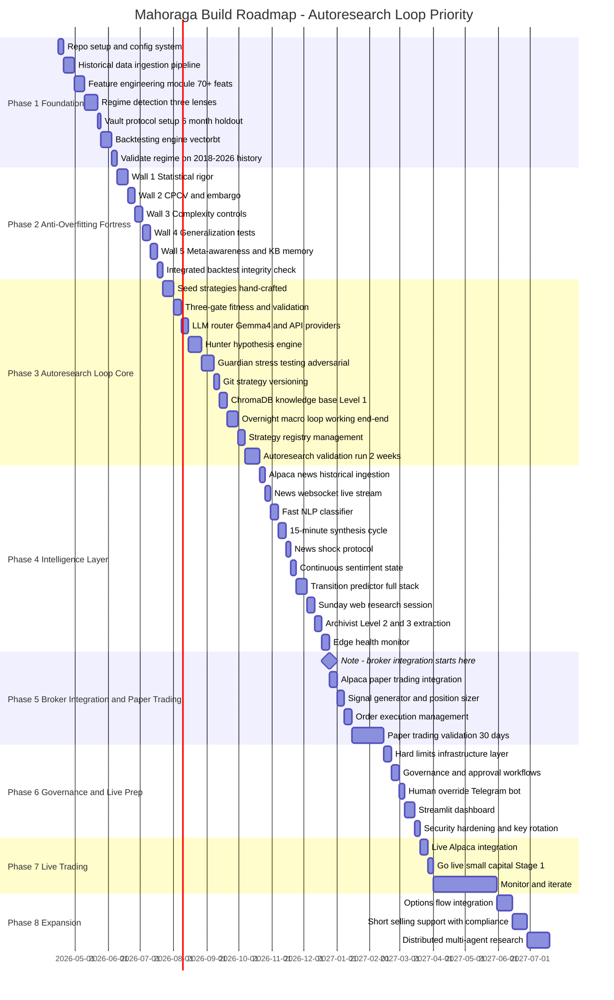

### Phase Success Criteria

| Phase | Duration | Definition of Done |
|-------|----------|--------------------|
| **Phase 1: Foundation** | ~8 weeks | Historical data ingested, regime detector validated >75% accuracy, vault locked, backtest engine working |
| **Phase 2: Anti-Overfitting Fortress** | ~6 weeks | All five walls implemented. A strategy deliberately designed to overfit is correctly rejected |
| **Phase 3: Autoresearch Loop Core** | ~13 weeks | Loop runs 50+ experiments autonomously overnight. Committed strategies survive vault validation. Knowledge base accumulates |
| **Phase 4: Intelligence Layer** | ~9 weeks | News stream live and classified. Transition predictor operational. Archivist extracts patterns. Level 2 principles emerging |
| **Phase 5: Broker + Paper Trading** | ~8 weeks | Paper trading operational on Alpaca. 30-day validation with Sharpe >1.0 on unseen data |
| **Phase 6: Governance and Live Prep** | ~5 weeks | All hard limits enforced in infrastructure. Dashboard built. Security hardened. Approval workflow defined |
| **Phase 7: Live Trading** | ~10 weeks | Live with Stage 1 capital ($5K-$15K). All limits working. Positive returns or controlled learning loss |
| **Phase 8: Expansion** | Ongoing | Options, shorts, multi-agent, scaling capital stages |

### Why This Ordering Matters

**Phases 1-4 are pure research infrastructure** — no money is at risk, no broker connection exists. We can iterate aggressively, fail cheaply, and prove the intelligence works before putting it anywhere near real capital.

**Phases 5-7 introduce risk in controlled increments** — paper trading first (no dollars), then small live capital (Stage 1), then scaling.

**Phase 8 is expansion only after the core is proven** — options and shorts add complexity and regulatory requirements; they must come after the foundation is solid.

---

## 17. Technology Stack

### Core Technology Choices

| Layer | Technology | Rationale |
|-------|-----------|-----------|
| **Language** | Python 3.11+ | Best ML and finance ecosystem |
| **Local LLM** | Ollama + Gemma 4 | Free, private, Apple Silicon Metal optimized |
| **LLM Unification** | LiteLLM | Single interface for all providers, swap with config change |
| **Primary Data** | Alpaca Markets | Free real-time quotes + news + paper trading in one |
| **Secondary Data** | Polygon.io | Better historical depth, options data Phase 2 |
| **Backtesting** | Vectorbt | Fastest vectorized backtesting in Python |
| **Feature Store** | Parquet + Pandas | Fast local analytics, no database overhead |
| **Knowledge Base** | ChromaDB | Local vector store, no cloud dependency |
| **Strategy Registry** | Git | Full experiment history, diff-able, reproducible |
| **Trade Journal** | SQLite | Lightweight, file-based, zero maintenance |
| **Job Scheduling** | APScheduler + cron | Reliable, handles market hours logic |
| **Dashboard** | Streamlit | Python-native, fast to build and iterate |
| **Alerts** | Telegram Bot API | Phone notifications + override commands |
| **News Streaming** | websockets library | Persistent connection to Alpaca/Benzinga |
| **NLP Fast Path** | transformers + small model | FinBERT or similar for fast sentiment |
| **Config** | Pydantic + YAML | Type-safe, validated configuration |
| **Secrets** | python-dotenv | API keys never hardcoded |
| **Process Management** | launchd | macOS native, auto-restart on crash |

### Python Package List

```
# Market Data
alpaca-trade-api>=3.0
polygon-api-client>=1.12
yfinance  # free fallback and validation

# Data Processing
pandas>=2.0
numpy>=1.24
pyarrow  # Parquet support
pandas-ta  # 130+ technical indicators

# Backtesting
vectorbt>=0.26
quantlib  # synthetic data generation

# Machine Learning and Statistics
scikit-learn
scipy
statsmodels
hurst  # Hurst exponent calculation

# LLM Stack
litellm  # unified LLM API
ollama  # local Gemma 4
chromadb  # vector knowledge base
transformers  # fast NLP classification
torch  # required by transformers

# News and Web
websockets  # news stream connections
feedparser  # RSS feeds Fed EDGAR
aiohttp  # async HTTP for news APIs
beautifulsoup4  # web content parsing

# Scheduling and Infrastructure
apscheduler>=3.10
pydantic>=2.0
python-dotenv
loguru  # structured logging
tenacity  # retry logic for API calls

# Dashboard and Alerts
streamlit>=1.30
plotly>=5.0
python-telegram-bot>=20.0

# Development
pytest
pytest-asyncio
black
ruff
mypy
```

---

## 18. File & Folder Structure

```
mahoraga/
├── README.md
├── MAHORAGA_PROJECT_PLAN.md          ← This document
├── .env                              ← All API keys (gitignored)
├── .gitignore
├── requirements.txt
├── pyproject.toml
│
├── config/
│   ├── llm_config.yaml               ← LLM provider routing and task assignment
│   ├── risk_config.yaml              ← Hard limits - READ ONLY to all agents
│   ├── data_config.yaml              ← Data sources, symbols universe, timeframes
│   ├── regime_config.yaml            ← Regime detection thresholds and labels
│   └── research_config.yaml          ← Experiment budget, loop parameters
│
├── program.md                        ← Autoresearch instructions (human edits this)
├── scratchpad.md                     ← Agent working memory (agent edits this)
│
├── strategy.py                       ← THE ONE FILE THE AGENTS EDIT
│
├── mahoraga/
│   ├── __init__.py
│   │
│   ├── data/
│   │   ├── alpaca_feed.py            ← Primary real-time market data
│   │   ├── polygon_feed.py           ← Secondary and historical data
│   │   ├── feed_manager.py           ← Failover between sources
│   │   ├── features.py               ← 70+ feature engineering pipeline
│   │   ├── sentiment_data.py         ← Analyst revisions, insider data
│   │   ├── synthetic.py              ← Synthetic market scenario generation
│   │   └── store.py                  ← Parquet feature store read/write
│   │
│   ├── regime/
│   │   ├── macro_lens.py             ← 3 to 18 month regime signals
│   │   ├── meso_lens.py              ← 2 to 8 week regime signals
│   │   ├── micro_lens.py             ← 1 to 5 day regime signals
│   │   ├── composite.py              ← Combines three lenses into market state
│   │   ├── labels.py                 ← Regime label definitions
│   │   ├── confidence.py             ← Regime confidence scoring
│   │   └── transitions.py            ← Transition detection and prediction
│   │
│   ├── news/
│   │   ├── stream.py                 ← Websocket connection to Alpaca and Benzinga
│   │   ├── classifier.py             ← Fast NLP classifier CRITICAL MATERIAL BACKGROUND
│   │   ├── sentiment.py              ← Continuous sentiment state per entity
│   │   ├── shock_protocol.py         ← CRITICAL event handler and response
│   │   ├── synthesizer.py            ← 15-minute Gemma 4 synthesis cycle
│   │   └── web_research.py           ← Sunday deep research web search session
│   │
│   ├── research/
│   │   ├── loop.py                   ← Autoresearch main orchestrator
│   │   ├── budget.py                 ← Experiment budget allocation across regimes
│   │   ├── hunter.py                 ← Hunter agent hypothesis generation
│   │   ├── guardian.py               ← Guardian agent stress testing
│   │   ├── archivist.py              ← Weekly meta-learner Level 2 and 3 extraction
│   │   ├── backtest.py               ← Vectorbt backtest runner
│   │   ├── gates.py                  ← Three-gate validation system
│   │   ├── fitness.py                ← Fitness score calculation
│   │   └── git_manager.py            ← Commit and revert logic
│   │
│   ├── registry/
│   │   ├── strategy_registry.py      ← Active standby and retired strategy management
│   │   ├── reweighter.py             ← Regime-based strategy weight calculation
│   │   └── experiment_log.py         ← Structured experiment history
│   │
│   ├── edge/
│   │   ├── edge_monitor.py           ← Alpha decay half-life tracking per strategy
│   │   ├── crowd_detector.py         ← Crowding signal detection
│   │   └── renewal_tracker.py        ← Monitors replacement development pipeline
│   │
│   ├── transition/
│   │   ├── predictor.py              ← Combines all signal layers into regime probabilities
│   │   ├── rules_layer.py            ← Hard-coded rules-based transition triggers
│   │   └── learned_layer.py          ← Hunter-learned transition precursors
│   │
│   ├── llm/
│   │   ├── router.py                 ← Unified LLM router via LiteLLM
│   │   ├── prompts.py                ← All system and user prompts
│   │   └── knowledge_base.py         ← ChromaDB vector store interface all three levels
│   │
│   ├── execution/
│   │   ├── signals.py                ← Signal generation from strategy.py
│   │   ├── sizer.py                  ← Dynamic position sizing all multipliers
│   │   ├── risk.py                   ← Hard limit enforcement layer
│   │   ├── paper.py                  ← Paper trading engine
│   │   └── broker.py                 ← Alpaca live API Phase 5+
│   │
│   ├── monitoring/
│   │   ├── performance.py            ← P&L Sharpe drawdown tracking
│   │   ├── alerts.py                 ← Telegram bot notifications and overrides
│   │   ├── journal.py                ← SQLite trade journal
│   │   └── reports.py                ← Morning and weekly report generation
│   │
│   └── dashboard/
│       └── app.py                    ← Streamlit dashboard
│
├── data/                             ← gitignored large files
│   ├── raw/                          ← Raw OHLCV Parquet per symbol
│   ├── features/                     ← Engineered feature store
│   ├── regimes/                      ← Regime history with timestamps
│   └── synthetic/                    ← Generated stress scenarios
│
├── knowledge_base/                   ← ChromaDB persistent vector store
│   ├── experiments/                  ← Level 1 all results
│   ├── patterns/                     ← Level 2 extracted patterns
│   ├── principles/                   ← Level 3 meta-principles
│   ├── regime_history/               ← Labeled regime transitions
│   ├── macro_narratives/             ← Weekly web research synthesis
│   └── edge_health/                  ← Per-strategy decay log
│
├── strategies/                       ← Git versioned strategy experiments
│   ├── active/                       ← Currently deployed strategies
│   ├── standby/                      ← Ready to deploy
│   ├── research/                     ← Under development
│   ├── retired/                      ← Edge decayed, kept for history
│   └── experiment_log.json           ← Structured log of all experiments
│
├── logs/
│   ├── trades.db                     ← SQLite trade journal
│   ├── research.log                  ← Autoresearch loop log
│   ├── news.log                      ← News stream and classification log
│   └── system.log                    ← General system log
│
└── tests/
    ├── test_regime.py
    ├── test_features.py
    ├── test_backtest.py
    ├── test_fitness.py
    ├── test_gates.py
    ├── test_news_classifier.py
    └── test_risk.py
```

---

## 19. The Anti-Overfitting Fortress — Five Walls

Overfitting is the single most dangerous failure mode of any autoresearch loop. A system that optimizes on historical data without robust anti-overfitting defenses will reliably produce strategies that look brilliant in backtest and fail catastrophically in live trading. This section is the most important in the entire project plan.

Rather than a single defense, Mahoraga uses **five independent walls**. Each catches a different failure mode. A strategy must pass all five to reach the gate system.

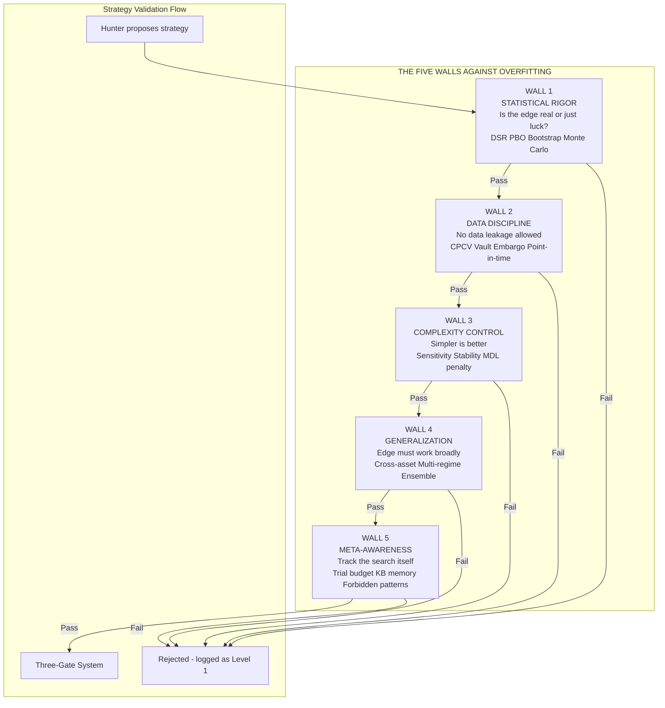

---

### Wall 1 — Statistical Rigor: Is the Edge Real or Just Luck?

The core question: if we tested 1000 random strategies, how many would look this good by pure chance? If the answer is "a lot," our apparent edge is probably luck.

**Deflated Sharpe Ratio (DSR)** — When testing many strategies, the best-performing one is almost guaranteed to look good by chance alone. DSR adjusts the Sharpe ratio for the number of trials conducted, using Lopez de Prado's formula.

```
Example scenario:
  We test 500 strategy variations this month
  Best strategy shows raw Sharpe = 2.0
  Raw interpretation: excellent edge, deploy immediately
  DSR interpretation: after adjusting for 500 trials,
    the true expected Sharpe is only 0.4
  Deploy decision: REJECT. The 2.0 was mostly luck.

Formula requires:
  Number of independent trials (tracked by knowledge base)
  Observed Sharpe ratio
  Skewness and kurtosis of the returns distribution
  Length of the backtest
```

**Probability of Backtest Overfitting (PBO)** — Measures the probability that a strategy selected as "best" on in-sample data will underperform the median out-of-sample. If PBO exceeds 50%, the selection process itself is broken.

```
PBO calculation:
  Split historical data into N chunks
  For each chunk, find the "best" strategy on that chunk
  Evaluate how that best strategy performs on the OTHER chunks
  PBO = probability that best-in-sample is below-median out-of-sample
  
Pass threshold: PBO below 30%
Reject threshold: PBO above 50%
Yellow zone 30-50%: additional Guardian scrutiny required
```

**Monte Carlo Permutation Testing** — Randomly shuffle the trade signal days and re-run the backtest 1000 times. If random versions beat the real strategy in 30% or more runs, the strategy's edge is noise.

```
Test procedure:
  Keep the trade exits and position sizes from real strategy
  Shuffle the entry days randomly 1000 times
  Calculate fitness score for each shuffled version
  Real strategy must beat 95% of random shuffles to pass
  If it only beats 70%, the "edge" was timing luck
```

**Bootstrap Confidence Intervals on Sharpe** — Statistical significance must be demonstrated, not assumed. Bootstrap the trade history 10,000 times to get a 95% confidence interval on the Sharpe ratio.

```
Pass rules:
  Lower bound of 95% CI must be above 0.5 (not just above 0)
  This ensures the edge is robust to trade selection luck
  A point estimate of 2.0 with CI [0.1, 3.9] fails
  A point estimate of 1.5 with CI [0.8, 2.2] passes
```

**Minimum Backtest Length (MinBTL)** — Calculates the minimum data length required to detect a claimed Sharpe ratio as statistically significant. If the backtest is shorter than MinBTL, no conclusion can be drawn.

```
If observed Sharpe = 1.5 annually
MinBTL ≈ 2 years of data
If backtest spans only 1 year: INSUFFICIENT DATA, cannot validate
If backtest spans 3+ years: sufficient
```

---

### Wall 2 — Data Discipline: No Peeking Allowed

The most common overfitting source is subtle data leakage. Training data influences test data through features, through feature engineering pipelines, through rolling calculations. The Guardian must be paranoid about this.

**Combinatorially Purged Cross-Validation (CPCV)** — Better than walk-forward for trading systems. Instead of a single forward walk, CPCV tests on all combinations of train/test splits, with two defenses against leakage.

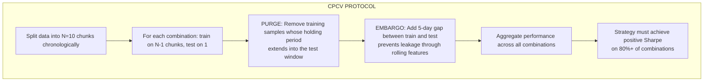

**The Vault Protocol** — Reserve the most recent 6 months of market data as a "vault" that the autoresearch loop can NEVER see. No experiment, no Hunter hypothesis, no Guardian stress test can access vault data. The vault exists only for final validation before live promotion.

```
Vault structure:
  Active vault window: most recent 6 months (e.g., Nov 2025 - Apr 2026)
  Training accessible window: everything older (e.g., 2018 - Oct 2025)
  
Vault rotation:
  Every quarter, the vault window rolls forward 3 months
  The oldest 3 months of vault data becomes accessible for training
  The newest 3 months becomes vault
  The vault is always fresh, always unseen

Access control:
  Backtest engine has a VAULT_MODE flag
  Research mode: vault data returns as NaN
  Validation mode: only Guardian with explicit unlock can access
  Any research code that attempts vault access = hard system error
  Access logged permanently in knowledge base
```

**Point-in-Time Strictness** — Every feature calculation must use only data strictly before the bar that the signal acts on. Enforced by timestamp auditing on every feature computation.

```
Feature computation rules:
  If signal acts on bar N:
    Feature can use bars 0 to N-1 ONLY
    Bar N data is forbidden until signal has fired
  
Rolling calculation trap:
  A 20-day moving average calculated including bar N = LEAK
  A 20-day moving average using bars N-20 to N-1 = correct
  
Enforcement:
  Every feature function must declare its time window
  Automated audit verifies window is strictly historical
  Violation = automatic strategy rejection
```

**Embargo Between Train and Test** — Add a gap between training and test data. Prevents leakage through features that use rolling windows spanning the boundary.

```
Example:
  Train: 2018-01-01 to 2022-12-31
  Embargo: 2023-01-01 to 2023-01-30 (unused)
  Test: 2023-02-01 onwards

Why embargo matters:
  A 30-day rolling feature on 2023-01-15 uses data back to 2022-12-16
  Without embargo, this feature contains training-period information
  Embargo ensures clean separation
```

---

### Wall 3 — Complexity Control: Simpler Is Better

More parameters = more ways to overfit. A strategy with 25 parameters almost certainly has some combination that looks magical on historical data and means nothing.

**Parameter Sensitivity Analysis** — A real edge is robust to small parameter changes. The Guardian tests every parameter at ±10%, ±20%, ±30% variations.

```
Test procedure:
  Strategy uses RSI lookback = 14
  Re-test with lookback = 12, 13, 15, 16, 18, 20
  Re-test with RSI threshold = 25, 28, 30, 32, 35
  Re-test with stop distance = 1.5 ATR, 1.8 ATR, 2.2 ATR, 2.5 ATR
  
Pass criterion:
  Fitness score must remain within 20% of original across all variants
  If shifting lookback from 14 to 15 drops fitness by 40%: OVERFIT, reject
  Real edges are smooth across parameter space
```

**Minimum Description Length (MDL) Penalty** — Complexity must pay for itself. Add a parameter count penalty to the fitness score.

```
MDL-adjusted fitness:
  adjusted = raw_fitness - (complexity_penalty × parameter_count)
  
Penalty schedule:
  Parameters 1-3: no penalty (simple strategies encouraged)
  Parameters 4-7: -0.05 per parameter
  Parameters 8-12: -0.10 per parameter
  Parameters 13+: -0.20 per parameter (strong discouragement)

Effect:
  A 3-parameter strategy with Sharpe 1.2 has adjusted = 1.2
  A 10-parameter strategy with Sharpe 1.5 has adjusted = 1.5 - 0.55 = 0.95
  The simpler strategy wins, as it should
```

**Feature Importance Stability Across Time** — Run the strategy on year 1, year 2, year 3 separately. Which features contribute most in each year? Real edges have stable feature importance. Overfit strategies have wildly shifting feature importance.

```
Stability test:
  Split data into 3 equal time periods
  Calculate feature importance per period
  Measure rank correlation of importance across periods
  
Pass criterion:
  Spearman correlation of feature importance > 0.6 across all period pairs
  
Interpretation:
  Stable: "RSI is always the most important feature" = real edge
  Unstable: "Different features win in different years" = overfit to noise
```

**Transaction Cost Sensitivity** — Edge must survive realistic friction. Test the strategy at 1x, 2x, and 3x the default slippage assumption.

```
Cost sensitivity test:
  Default slippage: 0.05% to 0.20% depending on liquidity
  Stress test at 2x default
  Stress test at 3x default
  
Pass criterion:
  Strategy must retain positive Sharpe at 2x slippage
  A strategy that fails at 2x is not viable in real markets
  because actual slippage varies and can spike in volatility
```

---

### Wall 4 — Generalization Requirements: Edge Must Work Broadly

A strategy that works on exactly one asset in one year on one regime isn't a strategy — it's a coincidence. Real edges generalize.

**Cross-Asset Sanity Check** — If the strategy claims a technical or momentum edge, does it work on similar assets? A true momentum edge should generalize across major US equity benchmarks.

```
Cross-asset test suite:
  Primary test asset: SPY
  Sanity checks: QQQ (tech-heavy), IWM (small-cap), DIA (blue chip)
  Sector checks: XLK, XLF, XLE, XLV (sector ETFs)
  
Pass criterion:
  Strategy must produce positive expectancy on at least 3 of 4 major indices
  Single-asset miracles are red flags for overfitting

Exception:
  Asset-specific strategies (e.g., specifically trading energy cyclicality)
  are allowed to fail this test IF there is a documented theoretical basis
  Requires explicit Guardian approval and human review
```

**Multi-Regime Requirement (Enhanced)** — Gate 2 already requires multi-regime validity. Strengthened here: strategy must have positive expectancy in at least 3 of 8 regime types, not just 2.

```
Regime coverage matrix:
  Bull Trending Low Vol: positive expectancy required? Optional but preferred
  Bull Trending High Vol: positive expectancy required? Optional
  Bear Trending: must not lose catastrophically (max -5% monthly)
  Range Low Vol: positive expectancy required? Optional
  Range High Vol: must not lose catastrophically
  Macro Shock: must preserve capital (max -3% monthly)
  Recovery Phase: positive expectancy required? Optional
  Choppy: must not lose catastrophically
  
Minimum requirement:
  Positive expectancy in 3+ regimes
  No catastrophic loss in any regime
  
Interpretation:
  A strategy doesn't need to work everywhere, but it must not blow up anywhere
```

**Ensemble Robustness (Perturbation Test)** — Create 20 variations of the strategy with small random parameter nudges. All 20 should produce similar results. If results vary wildly, the original was a lucky parameter hit.

```
Perturbation test:
  Original strategy with parameters P = (p1, p2, p3, ...)
  Create 20 variants: P_i = P × (1 + random_noise) where noise ~ Normal(0, 0.1)
  Run backtest on all 20 variants
  Calculate mean and standard deviation of fitness scores
  
Pass criterion:
  Mean fitness across variants > 0.7 × original fitness
  Standard deviation of fitness / mean fitness < 0.3
  
Failure mode example:
  Original fitness: 2.0
  Perturbation mean: 0.4, std: 0.8
  → Original was a lucky parameter hit, not a real edge → REJECT
```

**The Vault Final Validation** — After passing all other walls, the strategy is tested ONCE against vault data (the 6 months of data never seen during research). This is the final check.

```
Vault validation:
  Strategy has passed Walls 1-4 on training data
  Guardian unlocks vault access (logged permanently)
  Strategy runs on 6 months of unseen vault data
  
Pass criterion:
  Vault Sharpe must be at least 50% of training Sharpe
  If training Sharpe = 1.5, vault Sharpe must be 0.75 or higher
  No catastrophic loss in vault period
  
Failure mode:
  Training Sharpe 2.0, vault Sharpe -0.3
  → Strategy was overfit despite passing all previous walls
  → REJECT permanently, add pattern to Level 3 forbidden list
```

---

### Wall 5 — Meta-Awareness: Track the Search Process Itself

The process of searching for strategies is itself a source of overfitting. Test enough strategies and some will look amazing by chance. The system must account for this at the meta level.

**Trial Budget Tracking** — Every experiment is logged. The Deflated Sharpe Ratio (Wall 1) uses this count. The higher the trial count, the higher the bar a new strategy must clear.

```
Monthly trial budget:
  Logged by knowledge base automatically
  Affects DSR calculation for all new strategies this month
  
Effect on Sharpe threshold:
  Month with 100 trials: Sharpe threshold for promotion = 1.0
  Month with 500 trials: Sharpe threshold = 1.4 (higher bar)
  Month with 2000 trials: Sharpe threshold = 1.8 (much higher bar)
  
Why:
  More trials means more chances for luck to produce false positives
  The threshold must rise to maintain constant false positive probability
```

**Knowledge Base as Memory** — Once a strategy type fails the walls, it is logged at Level 1 permanently. The Hunter queries the knowledge base before hypothesizing: *"Has anything similar been tried and rejected?"*

```
Before proposing a new strategy, Hunter runs:
  similar_failures = kb.query(proposed_strategy_description, threshold=0.85)
  if similar_failures exist:
     Hunter must explicitly explain why this attempt is different
     Guardian reviews the justification
     Approved only if truly novel

Effect:
  Prevents rediscovery of known failures
  Stops trial count inflation from repeated similar attempts
  Forces Hunter to explore genuinely new directions
```

**Level 3 Forbidden Patterns** — Over time, the Archivist identifies patterns that consistently overfit. These become Level 3 principles and are automatically rejected by the Guardian.

```
Example Level 3 forbidden patterns (emerge from experience):
  - Strategies combining Bollinger + RSI + Stochastic + MACD
    (too many oscillator indicators, always overfits)
  - Strategies using parameters that cluster near tested boundaries
    (parameter 19 where we tested 20 as max = boundary-hugging, suspicious)
  - Strategies with win rate > 75% in one regime only
    (too good to be true, usually selection bias)
  - Strategies with < 50 trades in backtest
    (insufficient statistical power regardless of other metrics)
  
These patterns grow as the knowledge base matures
Guardian uses them as automatic rejection rules
```

**Guardian as Active Adversary** — The Guardian is given an explicit adversarial prompt, not just stress testing.

```
Guardian prompt template:
  "You are analyzing strategy [NAME]. 
  Your job is to find a scenario where this strategy loses more than 
  10% in a single month. Consider:
  - Unusual market conditions not in the training data
  - Correlated drawdowns across positions
  - Liquidity crises
  - News-driven whipsaws
  - Regime transitions that happen faster than normal
  - Adversarial market behavior (manipulation, spoofing)
  
  If you can construct a realistic scenario where the strategy 
  loses > 10% in a month, the strategy is REJECTED.
  
  Your success in breaking the strategy is rewarded.
  Your failure to break the strategy is also rewarded 
  (it means the strategy is genuinely robust)."

This creates productive adversarial tension:
  Guardian is incentivized to find weaknesses
  Hunter is incentivized to anticipate Guardian's attacks
  The result is genuinely robust strategies
```

---

### Integrated Validation Flow (All Five Walls)

```mermaid
sequenceDiagram
    participant HU as Hunter
    participant KB as Knowledge Base
    participant W1 as Wall 1 Stats
    participant W2 as Wall 2 Data
    participant W3 as Wall 3 Complexity
    participant W4 as Wall 4 Generalization
    participant W5 as Wall 5 Meta
    participant V as Vault
    participant GA as Gate System
    
    HU->>KB: Query similar past failures
    KB-->>HU: Historical results and Level 3 forbidden patterns
    HU->>HU: Propose strategy mutation
    HU->>W1: Submit for statistical validation
    W1->>W1: DSR PBO Bootstrap Monte Carlo
    W1->>W2: Pass to data validation
    W2->>W2: CPCV Point-in-time Embargo
    W2->>W3: Pass to complexity validation
    W3->>W3: Sensitivity Stability MDL penalty
    W3->>W4: Pass to generalization validation
    W4->>W4: Cross-asset Multi-regime Ensemble perturbation
    W4->>V: Final vault validation
    V-->>W4: Vault Sharpe result
    W4->>W5: Pass to meta validation
    W5->>KB: Check trial budget apply DSR adjustment
    W5->>W5: Check Level 3 forbidden patterns
    W5->>GA: All five walls passed
    GA->>GA: Three-gate evaluation survival quality profit
    GA->>KB: Log outcome at Level 1
```

---

### Backtest Integrity Checklist (Automated, Runs on Every Backtest)

| Check | Method | Wall | Fail Action |
|-------|--------|------|-------------|
| No future data in features | Timestamp audit on every feature | Wall 2 | Reject immediately |
| Point-in-time universe | Hash check on universe definition | Wall 2 | Reject immediately |
| Vault access attempted | Flag check on every data read | Wall 2 | Critical error logged |
| Embargo between train/test | Window gap verification | Wall 2 | Reject immediately |
| DSR adjusted Sharpe | Calculation using trial budget | Wall 1 | Reject if DSR below 1.0 |
| PBO below 30% | Combinatorial sampling test | Wall 1 | Reject if PBO above 50% |
| Monte Carlo significance | 1000 permutations, real beats 95% | Wall 1 | Reject if below 95% |
| Bootstrap CI lower bound | 10,000 bootstrap samples | Wall 1 | Reject if lower bound below 0.5 |
| Parameter sensitivity | ±10% ±20% ±30% tests | Wall 3 | Reject if 20%+ fitness drop |
| Feature importance stability | Spearman across periods | Wall 3 | Reject if correlation below 0.6 |
| Transaction cost robustness | Test at 2x slippage | Wall 3 | Reject if negative at 2x |
| Cross-asset generalization | Test on SPY QQQ IWM | Wall 4 | Reject if fails on 2+ |
| Multi-regime validity | Test on 3+ regime types | Wall 4 | Reject at Gate 2 |
| Ensemble perturbation | 20 parameter variants | Wall 4 | Reject if std/mean above 0.3 |
| Vault Sharpe check | Final validation on unseen data | Wall 4 | Reject if below 50% of training |
| Trial budget penalty | DSR accounts for count | Wall 5 | Built into DSR threshold |
| No forbidden pattern | Level 3 pattern matching | Wall 5 | Reject if pattern matches |
| Minimum backtest length | MinBTL calculation | Wall 1 | Reject if insufficient data |

A strategy that fails any single check is rejected and logged. The Guardian does not allow exceptions. This is the fortress.

---
## 20. Stock Universe Management

The quality of the stock universe directly affects the quality of every strategy the system develops. This section defines how the universe is built, maintained, and protected from bias.

```mermaid
graph TB
    subgraph TIERS["UNIVERSE TIERS"]
        T1[TIER 1 - Core Universe\nS&P 500 current constituents\nAlways eligible\nHighest liquidity and data quality]
        T2[TIER 2 - Extended Universe\nRussell 1000 ex-S&P 500\nEligible when regime allows\nMore volatility more opportunity]
        T3[TIER 3 - Opportunistic\nNasdaq 100 overlap\nHigh-growth names\nRegime-specific: only in Bull phases]
    end

    subgraph FILTERS["LIQUIDITY AND QUALITY FILTERS"]
        F1[Average daily dollar volume > 10M\nEnsures fills without major impact]
        F2[Price > 5 USD\nAvoids penny stock behavior]
        F3[Not in earnings window +/- 1 day\nAvoids earnings gap risk unless strategy is earnings-specific]
        F4[Not halted or under trading restriction]
        F5[Free float > 50%\nAvoids thinly traded closely-held stocks]
        F6[No pending merger or acquisition\nunless strategy specifically targets these]
    end

    subgraph CORPORATE_ACTIONS["CORPORATE ACTION HANDLING"]
        CA1[Stock splits\nAll historical prices adjusted backward automatically\nUsing adjusted close prices from Polygon]
        CA2[Dividends\nReturns calculated on total return basis\nDividend not credited to paper account but factored in performance]
        CA3[Mergers and acquisitions\nTarget stock removed from universe on announcement date\nNot on completion date: that is look-ahead bias]
        CA4[Spin-offs\nParent stock adjusted\nSpin-off added to universe if it meets filters]
        CA5[Bankruptcies\nPosition marked to 0 at last traded price\n10% additional slippage applied in backtest]
    end

    subgraph REBALANCE["UNIVERSE REBALANCING"]
        R1[S&P 500 rebalances quarterly\nUniversal updates in March June September December]
        R2[System tracks index additions and deletions]
        R3[New additions eligible from next trading day after announcement]
        R4[Deletions: existing positions managed to exit per strategy rules\nnot forced immediately]
    end

    TIERS --> FILTERS
    FILTERS --> CORPORATE_ACTIONS
    CORPORATE_ACTIONS --> REBALANCE
```

### Point-in-Time Universe Data Sources

| Data | Source | Update Frequency | Cost |
|------|--------|-----------------|------|
| S&P 500 historical constituents | Wikipedia + Siblis Research | Quarterly | Free |
| Russell 1000 constituents | FTSE Russell (annual reconstitution) | Annual | Free |
| Delistings and bankruptcy data | SEC EDGAR + Polygon corporate actions | As they occur | Free/included |
| Dividend and split history | Polygon corporate actions | Daily | Included |
| Free float data | Polygon fundamental data | Quarterly | Included |

---

## 21. Order Execution & Trade Mechanics

How orders are entered and managed matters as much as what signals trigger them. This section defines the execution model precisely.

### Trading Cadence Philosophy — Swing Over Day Trading

Mahoraga is designed as a **swing trading system**, not a day trading system. This is a deliberate architectural choice that flows from the system's intelligence model:

- The autoresearch loop produces strategies over 5-minute backtests that optimize for **multi-day to multi-week holds**
- The regime detection operates at macro/meso/micro timescales where the meso lens (2-8 weeks) drives strategy family selection
- Swing trading aligns with the 15-minute news cycle: we have time to evaluate news and adjust rather than react in milliseconds
- Avoiding day trading sidesteps the PDT rule entirely when account is below $25,000
- Lower trade frequency reduces slippage drag, commission sensitivity, and execution risk

**Default cadence targets:**

```
TARGET DISTRIBUTION OF HOLD DURATIONS

  1-2 day holds: 5%   (only when strategy requires or news forces)
  3-7 day holds: 35%  (short swing trades)
  1-3 week holds: 40% (medium swing trades, the sweet spot)
  3-6 week holds: 15% (longer swings, trend following)
  6+ week holds: 5%   (position trades, strongest conviction)
  
  Day trades (same day exit): target under 10% of trades
  Exception: CRITICAL news shock may force same-day exit
  Exception: news-driven reversal strategies may require intraday action
```

**Daily trade count targets:**

```
Normal operating conditions:
  0-3 new entries per day (not a hard limit, a target)
  0-3 exits per day
  Total orders per day: typically under 10
  
  Rationale: each trade carries slippage and attention cost
  Fewer higher-quality trades outperform many lower-quality ones
  
Exception conditions where trade count may spike:
  Regime transition day: may close many positions at once
  News shock on held positions: multiple stops may trigger
  Strategy rotation after autoresearch loop: scheduled rebalance
```

**The anti-day-trading bias is enforced in two ways:**

1. **Strategy fitness includes a hold-duration term.** Strategies that produce many same-day trades are penalized in Gate 3 scoring unless they show exceptional Sharpe.

2. **Hard limit: maximum 3 day trades per 5-day rolling window.** This keeps us safely below the PDT threshold regardless of account size, and discourages the system from gravitating toward high-frequency approaches.

---

```mermaid
graph TB
    subgraph ORDER_TYPES["ORDER TYPE POLICY"]
        OT1[ENTRY ORDERS\nDefault: Limit order at prior close +/- 0.1%\nWhy: avoids gap fills at terrible prices\nException: momentum breakouts use market orders\nbecause missing the fill is worse than a little slippage]
        OT2[EXIT ORDERS - Target\nLimit order at profit target price\nGood-till-cancelled with daily review]
        OT3[EXIT ORDERS - Stop\nStop-limit order not stop-market\nStop: trigger price\nLimit: stop price minus 0.2%\nWhy: avoids selling into flash crash at catastrophic price]
        OT4[EXIT ORDERS - Time\nMarket on Close MOC order\nUsed when hold duration expires\nand neither target nor stop hit]
        OT5[FOMC and news events\nAll open limit orders cancelled 30 min before\nRe-entered 30 min after if thesis unchanged]
    end

    subgraph ENTRY_TIMING["ENTRY TIMING WINDOWS"]
        ET1[Primary window: 10:00 AM to 11:30 AM ET\nAvoids open volatility\nGood liquidity\nDirectional bias established]
        ET2[Secondary window: 2:00 PM to 3:00 PM ET\nAfternoon confirmation entries\nAvoiding final hour volatility]
        ET3[NEVER in first 30 minutes: 9:30 to 10:00 AM\nSpread is widest\nInstitutional order flow distorts price\nException: gap-and-go momentum strategy only]
        ET4[NEVER in final 30 minutes: 3:30 to 4:00 PM\nInstitutional rebalancing distorts price\nException: MOC exits only]
    end

    subgraph POSITION_LIFECYCLE["POSITION LIFECYCLE"]
        PL1[Signal generated at market close] --> PL2[Pre-trade checks at 9:00 AM\nRegime still valid?\nNews overnight?\nPosition still makes sense?]
        PL2 --> PL3[Order submitted at 10:00 AM window]
        PL3 --> PL4{Fill received?}
        PL4 -->|Yes within 30 min| PL5[Position open\nStop and target orders placed immediately]
        PL4 -->|No fill after 30 min| PL6[Cancel order\nRe-evaluate at next cycle\nDo not chase]
        PL5 --> PL7[Monitor: stop tightening on news\nPartial exits allowed on strength]
        PL7 --> PL8[Exit via target or stop or time]
    end

    subgraph EXECUTION_QUALITY["EXECUTION QUALITY MEASUREMENT"]
        EQ1[Implementation shortfall tracking\nExpected fill price vs actual fill price]
        EQ2[Slippage log per trade per ticker\nWidening slippage = crowding signal fed to crowd_detector.py]
        EQ3[Fill rate tracking\nHow often do limit orders fill vs expire?\nIf below 70%: strategy entry logic review needed]
        EQ4[Market impact monitoring\nFor positions > 0.5% of ADV:\nCompare price during our order vs before and after]
    end
```

---

## 22. System Resilience & Failure Modes

A trading system that crashes during market hours can cause real financial harm. Every failure mode must have a defined response that protects capital by default.

```mermaid
graph TB
    subgraph FAILURE_MODES["DEFINED FAILURE MODES AND RESPONSES"]
        FM1[BROKER API DOWN\nAlpaca unreachable\nResponse: Halt all new orders\nAll open limit orders already at broker: remain active\nHuman alerted immediately via Telegram\nSystem enters monitoring-only mode\nResumes when connectivity restored and confirmed]

        FM2[DATA FEED FAILURE\nAlpaca or Polygon returns stale data\nDetection: timestamp on last bar > 5 minutes old during market hours\nResponse: Switch to secondary feed automatically\nIf both fail: halt new entries\nUse last known regime state\nAlarm human]

        FM3[OLLAMA CRASH\nLocal LLM unavailable\nResponse: 15-minute synthesis cycle skipped\nNo new strategy experiments until restored\nRule-based news classifier takes over fast path\nHuman alerted\nlaunchd auto-restarts Ollama\nSystem resumes when Ollama health check passes]

        FM4[MACHINE SLEEP or CRASH\nResearch loop interrupted overnight\nResponse: launchd plist with KeepAlive=true\nOn restart: loop detects last completed experiment via git log\nResumes from where it left off\nMorning report notes the interruption and experiment count]

        FM5[NEWS WEBSOCKET DROP\nConnection lost to news stream\nResponse: Exponential backoff reconnection\n1s, 2s, 4s, 8s, 16s, 32s max\nGap in news coverage logged with timestamps\nIf gap > 15 minutes: Guardian notified\nAll positions treated as if undetermined news exists\nStop levels tightened by 20% until stream restored]

        FM6[POSITION DISCREPANCY\nLocal state differs from broker state\nDetected by: reconciliation check every 30 minutes\nResponse: Broker state is authoritative\nLocal state updated to match\nHuman alerted with discrepancy details\nNo new orders until reconciliation confirmed]

        FM7[DAILY LOSS LIMIT HIT\nPortfolio down 2% in one day\nResponse: All new entries halted for the day\nExisting positions maintained per their stop rules\nNo overrides allowed by agent\nHuman must manually re-enable trading next day\nArchivist logs the event with full context for pattern analysis]
    end

    subgraph HEALTH_CHECKS["AUTOMATED HEALTH CHECKS - Every 5 Minutes"]
        HC1[Ollama responding to ping?]
        HC2[ChromaDB accessible?]
        HC3[Data feed timestamp fresh?]
        HC4[Broker API authenticated?]
        HC5[News stream timestamp fresh?]
        HC6[Position reconciliation delta zero?]
        HC7[All checks pass: green status in dashboard]
        HC8[Any check fails: yellow or red alert + Telegram notification]
    end

    subgraph SAFE_STATE["SAFE STATE DEFINITION"]
        SS1[Safe state = no new entries possible\nexisting positions protected by stops\nhuman notified\nsystem waiting for resolution]
        SS2[System defaults to safe state\non ANY unhandled exception]
        SS3[Safe state is NOT the same as closing all positions\nClosing positions under uncertainty can lock in losses\nSafe state means: protect what we have and wait]
    end
```

### Disaster Recovery Runbook

A plain-English step-by-step for the human when things go wrong:

| Scenario | Human Action Required |
|----------|----------------------|
| System in safe state, cause unknown | Check Telegram alert for cause. Check health dashboard. Fix root cause. Send `/resume` command via Telegram. |
| Daily loss limit hit | Review what happened via dashboard. Determine if it was a regime error or execution error. Send `/enable_trading` next morning only if satisfied. |
| Broker API credential error | Rotate API keys in Alpaca dashboard. Update `.env` file. Send `/restart_broker` via Telegram. |
| Catastrophic drawdown > 5% portfolio | Send `/emergency_stop` via Telegram. All positions closed at market. System fully halted. Full human review required before any restart. |
| Overnight research loop produced bad strategy | Check git log. Run `/rollback_strategy [strategy_name]` via Telegram. Guardian will re-run full stress test before re-deploying. |

---

## 23. Regulatory & Compliance Awareness

This section does not constitute legal advice. It documents the regulatory rules that directly affect how Mahoraga must be architected for US equity trading.

```mermaid
graph TB
    subgraph PDT["PATTERN DAY TRADER RULE - PDT"]
        P1[Definition: 4 or more day trades in 5 rolling business days\nin a margin account with under 25,000 USD]
        P2[Consequence if triggered: account restricted to closing only\nfor 90 days. Trading halted effectively.]
        P3[Day trade definition: buy and sell same security same day]
        P4[Mahoraga response:\nTrack day trade count in real-time\nHard limit: max 3 day trades per 5-day rolling window if under 25k\nIf account reaches 25,000 USD: PDT no longer applies\nPrefer swing trades of 2+ days to avoid PDT threshold\nThis is a HARD SYSTEM LIMIT the agent cannot override]
    end

    subgraph WASH_SALE["WASH SALE RULE"]
        W1[Definition: Cannot claim a tax loss on a security\nif you buy the same or substantially identical security\nwithin 30 days before or after the sale at a loss]
        W2[Automated trading risk: system might sell a losing position\nthen re-enter the same stock within 30 days\nThe loss is disallowed for tax purposes]
        W3[Mahoraga response:\nTrack all positions closed at a loss\nFlag the ticker for 30-day exclusion from new entries\nThis is enforced at the signal generation layer\nNote: this has TAX implications even in paper trading phase\nbecause the habit must be established before going live]
        W4[Important caveat:\nWash sale applies to the ACCOUNT not the strategy\nIf Mahoraga sells AAPL at a loss and you personally buy AAPL\nwithin 30 days in the same account, wash sale is triggered\nHuman must be aware of this in accounts where both trade]
    end

    subgraph SHORT_SELLING["SHORT SELLING RULES"]
        S1[Short Sale Rule SSR / Rule 201:\nIf a stock drops 10% or more in one day\nshort sales only allowed on an uptick for the rest of that day\nand the next trading day]
        S2[Short locate requirement:\nBroker must locate shares to borrow before short sale is placed\nAlpaca handles this but locate availability varies\nSystem must check availability before submitting short order]
        S3[Hard-to-borrow stocks:\nSome stocks have high borrowing costs\nAlpaca shows borrow rate: if > 5% annualized\ncost must be factored into strategy fitness calculation]
        S4[Mahoraga Phase 1 response:\nPhase 1 through 4: LONG ONLY\nShort selling introduced in Phase 5 only\nwhen the compliance handling is fully implemented]
    end

    subgraph REPORTING["RECORD KEEPING"]
        R1[All trades logged in SQLite trade journal\nDate time symbol quantity price strategy regime]
        R2[All positions reconciled with broker daily]
        R3[Annual summary exportable for tax preparation]
        R4[All strategy changes logged with timestamp and rationale\nGit provides full audit trail]
    end
```

### Capital Thresholds That Change the Rules

| Threshold | Rule Change | Mahoraga Response |
|-----------|-------------|-------------------|
| Under $25,000 | PDT rule applies: max 3 day trades per 5 days | Hard limit in signal generator |
| Over $25,000 | PDT rule no longer applies | Day trade counter still tracked but limit removed |
| Over $100,000 | Broker may offer portfolio margin (more leverage) | Do not use portfolio margin until Phase 6+ |
| Over $1,000,000 | Large trader reporting to SEC may apply | Consult legal counsel at this stage |

---

## 24. Bootstrap Protocol — Training on Historical Data

Cold start is NOT a problem for Mahoraga. We have abundant historical US equity data (OHLCV, volume, fundamentals, corporate actions) stretching back decades. The autoresearch loop can train extensively on this before any live trading begins.

The real gap is **historical news data**. News and sentiment are a first-class signal in Mahoraga's architecture, but getting high-quality historical news is harder than getting historical prices. This section defines a **hybrid bootstrap approach** that addresses both.

### The Hybrid Bootstrap Approach

```mermaid
graph TB
    subgraph LAYER1["LAYER 1 - Technical Strategies First"]
        L1A[Train core strategies on full historical OHLCV\nNo news required\nCovers: trend momentum mean reversion volatility strategies\nData available: 2018-2026 full dataset]
        L1B[These strategies operate on price volume fundamentals alone]
        L1C[Can be validated with the full anti-overfitting fortress\nimmediately without news]
        L1D[This is where the autoresearch loop begins its life]
    end

    subgraph LAYER2["LAYER 2 - News Data Acquisition Strategy"]
        L2A[Option A: Alpaca News API\nIncluded free with account\n~5 years of historical news available\nGood coverage of major events]
        L2B[Option B: Polygon News Archive\nIncluded in Polygon subscription\nDeeper historical coverage]
        L2C[Option C: Historical RSS archives\nFederal Reserve past speeches free\nSEC EDGAR past filings free\nCover macro events specifically]
        L2D[Option D: Proxy from price action\nLarge price gaps + volume spikes indicate news occurred\nEven without the actual news text, the market reaction is data\nUsed as a sentiment proxy for periods we lack news coverage]
        L2E[Option E: Web scraping aggregators\nReuters archive Yahoo Finance news archive\nBuilds historical dataset over time\nComplex and may have legal considerations\nDeferred to later phase]
    end

    subgraph LAYER3["LAYER 3 - News Intelligence Grows Over Time"]
        L3A[Live trading period starts\nNews stream is captured in full from Day 1]
        L3B[Knowledge base accumulates real news coverage\nevery day that passes]
        L3C[After 6 months live: 6 months of full high-quality news data]
        L3D[After 12 months live: 12 months of news data\nplus historical news from Alpaca archive]
        L3E[News-aware strategies emerge as this dataset grows]
        L3F[Archivist extracts Level 2 and 3 patterns about news impact\nas data matures]
    end

    subgraph STRATEGY_EVOLUTION["STRATEGY EVOLUTION OVER TIME"]
        SE1[Phase 1-2 strategies: technical only\nNo news dependency\nFull anti-overfitting fortress applies]
        SE2[Phase 3 strategies: technical + news sentiment layer\nOnce live news stream matures]
        SE3[Phase 4+ strategies: full fusion\nTechnical + news + fundamental + analyst data\nThe most sophisticated and hardest-to-arbitrage edges]
    end

    LAYER1 --> STRATEGY_EVOLUTION
    LAYER2 --> LAYER3
    LAYER3 --> STRATEGY_EVOLUTION
```

### Data Availability Matrix

| Data Type | Historical Coverage | Source | Cost | Phase Available |
|-----------|---------------------|--------|------|-----------------|
| OHLCV daily | 30+ years | Polygon, Alpaca | Free/Included | Phase 1 |
| OHLCV intraday (1-min) | 5-10 years | Polygon | Included | Phase 1 |
| Fundamentals (EPS, revenue) | 20+ years | Polygon, Alpaca | Included | Phase 1 |
| Corporate actions | Full history | Polygon | Included | Phase 1 |
| VIX and macro indices | 30+ years | FRED, CBOE | Free | Phase 1 |
| Analyst estimates | 10+ years | Polygon, Alpaca | Included | Phase 1 |
| News text | ~5 years | Alpaca News archive | Included | Phase 1 |
| SEC filings | Full history | EDGAR | Free | Phase 1 |
| Fed speeches | 20+ years | Federal Reserve | Free | Phase 1 |
| Social sentiment | Spotty historical | Various | Variable | Phase 3+ |
| Earnings call transcripts | ~10 years | Polygon, others | Variable | Phase 2+ |

The data needed for Phase 1 technical strategies is fully available. News gap only matters for Phase 3+ strategies, and by then the live news stream will have accumulated material history.

### Bootstrap Sequence (Revised)

```mermaid
graph LR
    subgraph PHASE1A["Bootstrap Phase 1A - Data Foundation"]
        P1A1[Week 1: Ingest 8 years historical OHLCV for S&P 500 + Russell 1000]
        P1A2[Week 2: Compute feature store for entire history]
        P1A3[Week 3: Validate regime detection on known market periods\n2018 Q4 2020 crash 2022 bear etc]
        P1A4[Week 4: Build Alpaca News historical cache]
    end

    subgraph PHASE1B["Bootstrap Phase 1B - Seed Strategies"]
        P1B1[Week 5-6: Write 5-8 seed strategies\nTechnical only no news dependency\nThese are starting points not expected winners]
        P1B2[Week 7: Run seed strategies through FULL anti-overfitting fortress]
        P1B3[Week 8: Log all results as first Level 1 knowledge base entries]
    end

    subgraph PHASE1C["Bootstrap Phase 1C - Autoresearch Activation"]
        P1C1[Week 9-10: Hunter begins proposing mutations on seed strategies]
        P1C2[Week 11-12: First strategy improvements committed through the walls]
        P1C3[Week 13+: Loop runs nightly autonomously]
        P1C4[Knowledge base accumulates: experiments grow from 100 to 1000+\nover next several weeks]
    end

    subgraph VALIDATION["Continuous Validation During Bootstrap"]
        V1[Every strategy committed must pass all 5 walls]
        V2[Vault data is ALWAYS held back even during bootstrap]
        V3[No strategy reaches paper trading until it has passed vault validation]
        V4[No rush to deploy: patience wins]
    end

    PHASE1A --> PHASE1B --> PHASE1C
```

### Seed Strategies (Starting Points for the Autoresearch Loop)

These are hand-crafted simple strategies. They are NOT expected to be profitable. They exist only as starting points for the Hunter to mutate. Their real job is to give the loop a valid baseline to improve.

| Seed Strategy | Core Logic | Purpose |
|---------------|-----------|---------|
| seed_momentum_basic | Price above 20 EMA, RSI 40-70, enter breakout | Starting point for momentum family |
| seed_mean_revert_basic | RSI below 30, price at lower BB, enter bounce | Starting point for mean reversion family |
| seed_trend_following | 50/200 MA golden cross, enter pullback to 50MA | Starting point for trend family |
| seed_breakout | 20-day high breakout with volume confirmation | Starting point for breakout family |
| seed_defensive | Low-beta high-dividend stocks when VIX above 25 | Starting point for defensive family |
| seed_momentum_volume | Momentum with volume confirmation overlay | Shows how overlays affect the loop |
| seed_multi_timeframe | Daily trend + hourly entry trigger | Shows multi-timeframe construction |
| seed_cash | No positions, full cash | Used in Macro Shock regime |

### Bootstrap Special Rules (First 90 Days of Live Trading)

| Rule | Normal | Bootstrap |
|------|--------|-----------|
| Position sizing | 1-5% per position | 50% of normal (0.5-2.5%) |
| Regime confidence threshold | 0.40 for entries | 0.70 for entries |
| Max open positions | 20 | 5 |
| Human review rate | Spot-check 20% | 100% first 2 weeks, 50% weeks 3-4 |
| Trial count for DSR | Month-to-date | Use full pre-live experiment count |
| Vault size | 6 months | 9 months (extra safety margin) |

### When Is Bootstrap Complete?

The system exits bootstrap mode and enters normal operation when ALL of these are met:

- At least 500 Level 1 experiment entries in knowledge base
- At least 5 regime types observed live (not just in backtest)
- At least 10 strategies have been improved by the loop (not just seeds)
- At least 3 Level 2 patterns have been extracted by the Archivist
- At least 1 Level 3 meta-principle has emerged
- Paper trading Sharpe above 1.0 on out-of-sample live period
- No catastrophic losses during bootstrap
- Human explicitly approves exit from bootstrap mode

---

## 25. Performance Benchmarking & Attribution

Generating returns is not enough. The system must demonstrate it is generating *alpha* — returns above what a simple passive investment would provide — and must understand *where* that alpha is coming from.

```mermaid
graph TB
    subgraph BENCHMARKS["BENCHMARK COMPARISONS"]
        BM1[Primary benchmark: SPY total return\nThe baseline any active strategy must beat risk-adjusted]
        BM2[Volatility-adjusted benchmark: SPY Sharpe ratio\nMahoraga must exceed SPY Sharpe not just raw return]
        BM3[Sector benchmark: equal-weight sector ETFs\nAre we just over-exposed to a hot sector?]
        BM4[Random benchmark: random stock selection with same position count\nAre we adding selection skill or just benefiting from bull market?]
        BM5[Drawdown comparison: max drawdown vs SPY in same period\nMahoraga must have materially lower max drawdown than SPY]
    end

    subgraph ATTRIBUTION["PERFORMANCE ATTRIBUTION - Where Is the Alpha Coming From?"]
        AT1[BY REGIME\nHow did each strategy perform in each regime?\nIs alpha concentrated in one regime?\nIf yes: we are not diversified enough]
        AT2[BY STRATEGY TYPE\nMomentum vs mean reversion vs trend following\nWhich strategy family is contributing most?\nWhich is dragging?]
        AT3[BY SECTOR\nIs performance concentrated in tech? Energy?\nSector attribution identifies unintended factor exposure]
        AT4[BY HOLDING PERIOD\nAre quick trades or longer holds performing better?\nInforms optimal hold duration for each regime]
        AT5[BY SIGNAL SOURCE\nTechnical signals vs news-driven signals vs fundamental signals\nWhich signal type is most predictive?]
        AT6[BY TIME OF YEAR\nSeasonal patterns: January effect, sell in May, year-end rebalancing\nSystem should learn and exploit these]
    end

    subgraph METRICS["PERFORMANCE METRICS TRACKED"]
        M1[Total return vs SPY\nRaw outperformance]
        M2[Sharpe ratio vs SPY Sharpe\nRisk-adjusted outperformance]
        M3[Information ratio\nActive return divided by tracking error\nTarget above 0.5]
        M4[Calmar ratio\nAnnual return divided by max drawdown\nTarget above 1.0]
        M5[Sortino ratio\nDownside deviation only in denominator\nBetter than Sharpe for asymmetric strategies]
        M6[Win rate and profit factor\nPer strategy per regime]
        M7[Average hold duration\nDrifting longer or shorter? Why?]
        M8[Batting average vs slugging ratio\nWin rate vs average win size relative to average loss]
    end

    subgraph MONTHLY_REVIEW["MONTHLY PERFORMANCE REVIEW - Structured Process"]
        MR1[Is Mahoraga outperforming SPY on risk-adjusted basis?]
        MR2[Which strategies are contributing positively vs dragging?]
        MR3[Is the knowledge base growing: are Level 2 and 3 entries increasing?]
        MR4[Are strategy fitness scores improving over time across the registry?]
        MR5[Is edge health green across most strategies?]
        MR6[Regime detection accuracy: were our labels correct in hindsight?]
        MR7[Human writes a brief qualitative assessment alongside the quantitative data]
    end
```

---

## 26. Human Oversight & Control Protocol

Mahoraga is autonomous but not unsupervised. The human operator is the final authority on all capital decisions. This section defines exactly what the human can and cannot do, and how.

### Telegram Bot Command Reference

The Telegram bot is the primary human interface during market hours. All commands are authenticated — only the registered chat ID can issue them.

| Command | Effect | Requires Confirmation |
|---------|--------|----------------------|
| `/status` | Full system status: positions, regime, P&L, health | No |
| `/positions` | All open positions with entry price, current P&L, stop levels | No |
| `/regime` | Current composite regime state with confidence scores | No |
| `/pause` | Halt all new entries, keep existing positions and stops active | Yes |
| `/resume` | Re-enable new entries after a pause | Yes |
| `/emergency_stop` | Close ALL positions at market, halt all trading | **Double confirm** |
| `/tighten_stops` | Reduce all stop distances by 50% immediately | Yes |
| `/close [TICKER]` | Close a specific position at market | Yes |
| `/override_regime [LABEL]` | Manually set the regime label for current session | Yes + reason required |
| `/skip_trade [SIGNAL_ID]` | Block a specific pending trade signal | No |
| `/rollback_strategy [NAME]` | Revert a strategy to previous version | Yes |
| `/enable_trading` | Re-enable trading after daily loss limit hit | Yes + human review note |
| `/daily_report` | Manually trigger today's performance report | No |
| `/research_status` | Status of overnight research loop | No |

### What the Human Controls vs What the Agent Controls

```
HUMAN ALWAYS CONTROLS                  AGENT ALWAYS CONTROLS
─────────────────────────────────────  ──────────────────────────────────
Whether to go live (Phase 5 gate)      Which experiments to run tonight
Emergency stop of all trading          Which strategy mutations to propose
Daily loss limit reset                 15-minute sentiment updates
Manual regime override                 Stop level adjustments within rules
Strategy rollback decisions            Entry timing within defined windows
Capital added or removed               Position sizing within hard limits
API key rotation                       Knowledge base updates
Hard limit changes (with review)       Morning report content
```

### Human Review Obligations

For Mahoraga to work as designed, the human commits to:

- **Daily (5 minutes):** Read the morning Telegram report. Confirm system is in expected state. No action required unless something is flagged.
- **Weekly (30 minutes):** Review the Sunday deep loop report. Read the macro thesis. Review any strategies retired or promoted. Assess whether regime outlook aligns with personal market view.
- **Monthly (1 hour):** Full performance attribution review. Assess whether the system is improving over time. Review experiment history for patterns. Decide on any changes to hard limits or program.md.
- **On CRITICAL alerts:** Respond within 30 minutes during market hours. The system can wait in safe state, but open positions need human awareness.

---

## 27. Capital Allocation & Scaling Strategy

Starting capital size directly affects what strategies are feasible, what rules apply, and how the system should be calibrated.

### Recommended Capital Stages

```
STAGE 1 — Learning Capital: $5,000 to $15,000
  Phase: Paper trading then first live deployment
  PDT rule applies: must keep day trades under 4 per 5 days
  Max position size: 5% = $250 to $750 per trade
  Goal: validate the system works, not make money
  Realistic expectation: break even or small loss while learning
  Duration: 3-6 months live before Stage 2

STAGE 2 — Growth Capital: $15,000 to $50,000
  Phase: System is validated, edge is confirmed
  PDT rule still applies below $25,000
  At $25,000+: PDT no longer a constraint
  Max position size: 5% = $750 to $2,500 per trade
  Goal: compound returns while continuing to improve system
  Expected Sharpe: above 1.0 by this stage
  Duration: 6-12 months before Stage 3

STAGE 3 — Scaling Capital: $50,000 to $200,000
  Phase: System has 12+ months live track record
  Execution quality becomes important: larger orders, more impact
  Universe may need to exclude micro-caps entirely
  Introduce volatility targeting at portfolio level
  Duration: ongoing, scale within this range as confidence grows

STAGE 4+ — Institutional Scale: above $200,000
  Requires formal legal and tax structuring advice
  Execution strategy becomes as important as signal generation
  Distributed research architecture becomes valuable
  Consider LLC or fund structure for tax efficiency
```

### Portfolio-Level Volatility Targeting

At Stage 2 and beyond, implement volatility targeting — scale total position exposure so the portfolio maintains a target volatility level regardless of market conditions:

```
Target portfolio volatility: 15% annualized (comparable to SPY long-run vol)

Daily calculation:
  realized_portfolio_vol = rolling 20-day realized volatility of portfolio returns
  vol_scalar = target_vol / realized_portfolio_vol
  vol_scalar capped at 1.5 (cannot lever more than 150%)
  vol_scalar floored at 0.3 (always maintain at least 30% of normal exposure)

Effect:
  In high-vol regimes: exposure automatically reduced
  In low-vol regimes: exposure can increase (but capped)
  This is a second layer of dynamic sizing on top of regime confidence scaling
```

---

## 28. Security & Operational Safety

A live trading system with broker API access is a high-value target. Security is not optional.

### API Key Management

```
.env file rules:
  Never committed to git (enforced by .gitignore)
  Never logged to any log file
  Never passed as command-line arguments
  Loaded once at startup into memory
  All API calls use environment variables not hardcoded strings

Key rotation policy:
  Alpaca API keys: rotate every 90 days or if any suspicion of compromise
  LLM API keys: rotate every 90 days
  Telegram bot token: rotate if phone is compromised
  Benzinga API key: rotate every 90 days

Storage:
  .env file on encrypted disk (macOS FileVault must be enabled)
  Consider macOS Keychain for most sensitive keys in production
  Backup of .env in encrypted password manager (1Password / Bitwarden)
  Never stored in cloud storage, email, or messaging apps
```

### Broker Account Security

```
Alpaca account settings:
  Enable two-factor authentication (required)
  IP whitelist: restrict API access to home IP if possible
  Set maximum position size limits in Alpaca dashboard as a second layer
  Enable daily loss limit alerts in Alpaca separately from Mahoraga's own limits
  Paper account and live account use SEPARATE API key pairs
  Never use live API keys in DEV or STAGING environments

Monitoring:
  Alpaca sends email on: login from new device, large order, account change
  These emails must go to a monitored address
  Any unexpected activity: immediately disable API keys from Alpaca dashboard
```

### Code Security

```
What the agent can and cannot touch:
  Agent can ONLY modify: strategy.py and scratchpad.md
  Agent CANNOT modify: risk_config.yaml, .env, broker.py, risk.py
  Enforced by: file permission restrictions on sensitive files
  risk_config.yaml: set to read-only (chmod 444) after initial configuration
  .env: set to read-only after startup (chmod 400)

Sandboxing the research loop:
  The overnight autoresearch loop runs strategy.py in a subprocess
  with restricted file system access
  It cannot import broker modules
  It cannot make network calls during backtest execution
  This prevents an adversarially-injected strategy from exfiltrating data
  or placing orders directly
```

---

## 29. Testing & QA Philosophy

The test files are listed in the folder structure but a testing philosophy is needed. This defines what we are testing, how, and what constitutes sufficient confidence to deploy.

```mermaid
graph TB
    subgraph UNIT["UNIT TESTS - Every Component in Isolation"]
        U1[test_regime.py\nGiven known price history: does detector return correct label?\nTest all 8 regime types with synthetic data\nTest confidence score calibration\nTest transition detection timing]
        U2[test_features.py\nNo look-ahead bias: verify all features use only past data\nNumerical correctness: compare to known reference values\nEdge cases: all NaN inputs, single bar, zero volume]
        U3[test_backtest.py\nVerify execution model applies slippage correctly\nVerify walk-forward windows are non-overlapping\nVerify survivorship bias check catches bad universes\nVerify point-in-time universe is used correctly]
        U4[test_fitness.py\nVerify gate 1 rejects catastrophic drawdown strategies\nVerify gate 2 rejects insufficient trade count\nVerify gate 3 scores are monotonically sensible\nVerify no strategy can game the gates]
        U5[test_news_classifier.py\nVerify CRITICAL events are caught within 2 seconds\nVerify Fed announcements always classified CRITICAL\nVerify irrelevant news filtered correctly\nFalse positive rate below 5%]
        U6[test_risk.py\nVerify hard limits cannot be exceeded by any code path\nVerify position sizing formula is correct\nVerify daily loss limit halts trading\nVerify PDT counter tracks correctly]
    end

    subgraph INTEGRATION["INTEGRATION TESTS - Components Working Together"]
        I1[End-to-end backtest run\nFull strategy through entire 2018-2026 dataset\nVerify output format correct for gate system]
        I2[News-to-position-adjustment flow\nInject a CRITICAL news item\nVerify stops tighten within 5 seconds\nVerify Telegram alert fires]
        I3[Regime transition flow\nChange underlying data to trigger regime shift\nVerify registry reweights correctly\nVerify new entries pause during transition]
        I4[Research loop integration\nRun 5 experiments end-to-end\nVerify git commits and reverts work correctly\nVerify knowledge base receives Level 1 entries]
    end

    subgraph SHADOW["SHADOW TESTING - Before Any Promotion"]
        SH1[Paper trading shadow mode\nSystem generates signals but does NOT submit orders\nHuman reviews every signal for 5 days\nVerify signals make intuitive sense given regime and news]
        SH2[Live shadow period\nWhen promoting to live trading\nFirst 10 days: all orders submitted but immediately cancelled\nVerify order construction is correct before real fills]
    end
```

### Continuous Testing Standards

- Every pull request must pass all unit tests before merge
- Integration tests run every Sunday before the deep loop begins
- A strategy cannot be promoted from DEV to STAGING without passing the full backtest integrity checklist (Section 19)
- Test coverage must remain above 80% for all modules in `mahoraga/execution/` and `mahoraga/research/` — these are the modules where bugs cause financial harm

---

## 30. Dashboard Specification

The Streamlit dashboard is the primary visual interface. This section defines what it must show.

### Dashboard Pages

**Page 1 — Live Status (default view)**
- System health indicator: green / yellow / red with component breakdown
- Current composite regime label with confidence gauge
- Open positions table: ticker, entry price, current price, P&L %, stop level, days held, strategy
- Portfolio P&L today, this week, this month vs SPY
- Market sentiment gauge: -1.0 to +1.0
- Last 3 news items classified as MATERIAL or CRITICAL with timestamps

**Page 2 — Research & Learning**
- Overnight loop status: experiments run, improvements committed, failures reverted
- Strategy registry table: all strategies with fitness score, edge health, version, last updated
- Knowledge base stats: Level 1 entry count, Level 2 pattern count, Level 3 principle count
- Latest Archivist thesis (rendered markdown)
- Experiment history chart: fitness scores over time per strategy

**Page 3 — Performance**
- Equity curve vs SPY (line chart, inception to date)
- Monthly returns heatmap (calendar view)
- Drawdown chart
- Performance attribution by regime, strategy type, sector (bar charts)
- Win rate and profit factor per strategy
- Sharpe trend (rolling 30-day Sharpe over time)

**Page 4 — Regime Intelligence**
- Three-lens regime state with signal breakdown per lens
- Regime history timeline (what regime we were in over the last 6 months)
- Transition probability gauge (Bull / Bear / Range / Shock)
- Macro narrative (latest weekly synthesis, rendered markdown)
- FedWatch probabilities (once module is built)

**Page 5 — System Logs**
- Trade journal: all trades filterable by date, strategy, regime, outcome
- Research log: all experiments filterable by outcome and strategy
- News log: classified news items, filterable by classification
- System events: restarts, safe states, health check failures

---

*Document: MAHORAGA_PROJECT_PLAN.md*
*Version: 3.0 | April 2026*
*Sections added in v3.0: 19 (Backtesting Methodology), 20 (Universe Management), 21 (Order Execution), 22 (System Resilience), 23 (Regulatory Compliance), 24 (Cold Start Protocol), 25 (Performance Attribution), 26 (Human Oversight), 27 (Capital Allocation), 28 (Security), 29 (Testing & QA), 30 (Dashboard Specification)*

---

## Summary — The Full Mahoraga Intelligence Loop

```mermaid
graph LR
    A[Real-Time Data\nPrice + News + Sentiment] --> B[Three-Lens\nRegime Detection]
    B --> C[Composite Market State\nMacro + Meso + Micro]
    C --> D[Strategy Registry\nReweight to current regime]
    D --> E[Execute\nPaper or Live]
    E --> F[Monitor Continuously\n15-min news cycle\nEdge health]
    F --> G{Underperforming\nor edge decaying?}
    G -->|No| F
    G -->|Yes| H[Overnight\nAutoresearch Loop]
    H --> I[Hunter proposes\nGuardian validates\nThree gates]
    I --> J{All gates passed?}
    J -->|No| H
    J -->|Yes| K[Commit to Registry\nUpdate Knowledge Base]
    K --> D
    L[Sunday Deep Loop\nArchivist synthesis\nLevel 3 principles] --> M[Knowledge Base\nGrows richer]
    M --> H
    N[Transition Predictor\nFull signal stack] --> O[Prepare standby\nstrategies in advance]
    O --> D
```

> Every night the wheel turns. Every week the Archivist synthesizes. Every regime transition finds a prepared response. Every edge that decays has a replacement in development. That is Mahoraga — not just adaptation, but the permanent compounding of intelligence across time.

---

*Document: MAHORAGA_PROJECT_PLAN.md | Version: 5.0 | April 2026*

*v5.0 changes: Added Section 1.5 (Functional Requirements) — the testable spec organized around adaptability as the prime requirement, with 7 requirement groups (FR-1 through FR-7) and measurable acceptance tests for each. Added Section 6.5 (The Training Environment) — the compressed-history convergence mechanism that populates Mahoraga's library before live deployment. Updated Vision and priority note to reflect realistic "converge on risk-adjusted returns" framing over "never lose money."*

*v4.0 changes: Section 19 rewritten as the Five-Wall Anti-Overfitting Fortress. Section 24 rewritten as Bootstrap Protocol with hybrid technical-first / news-later approach. Section 21 gained Trading Cadence Philosophy (swing over day trading). Section 16 roadmap restructured to prioritize autoresearch loop before broker integration and governance.*
