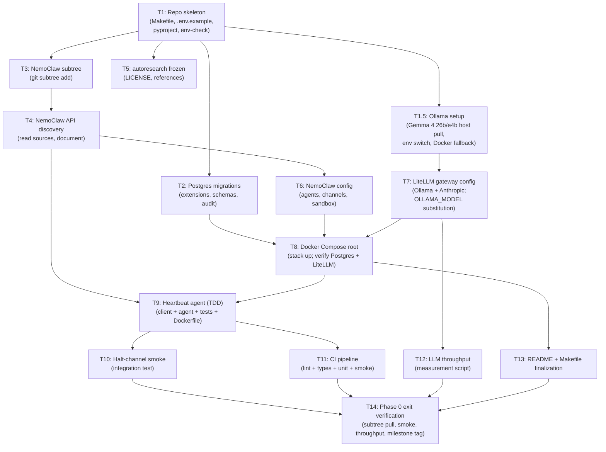

# Phase 0 — Tasks Dependency Graph

Companion to [`plan.md`](plan.md). The plan defines what each task does step-by-step; this file defines **task dependencies and parallel-execution waves** so subagent-driven development can pick up independent tasks concurrently.

## Dependency Graph

## Task summary

| # | Task | Depends on | Parallel-eligible with | TDD? |
|---|---|---|---|---|
| 1 | Repo skeleton | — | — | n/a (infra) |
| 1.5 | Ollama setup (Gemma 4 26b/e4b, host primary) | T1 | T2, T3, T5 | n/a (manual pull + verify) |
| 2 | Postgres migrations | T1 | T1.5, T3, T5 | yes (test_postgres_migrations.py) |
| 3 | NemoClaw subtree | T1 | T1.5, T2, T5 | n/a (verify-via-shell) |
| 4 | NemoClaw API discovery | T3 | T7 | n/a (research doc) |
| 5 | autoresearch frozen | T1 | T1.5, T2, T3 | n/a (verify-via-shell) |
| 6 | NemoClaw config | T4 | — | n/a (yaml-validate) |
| 7 | LiteLLM gateway config | T1.5 | T4 | n/a (config) |
| 8 | Docker Compose root | T2, T6, T7 | — | yes (run Postgres smoke) |
| 9 | Heartbeat agent | T4, T8 | T12 | yes (full TDD) |
| 10 | Halt-channel smoke | T9 | T11, T12 | yes (integration test) |
| 11 | CI pipeline | T9 | T10, T12 | n/a (workflow YAML; verified by green run) |
| 12 | LLM throughput | T7 | T9, T10, T11 | n/a (measurement) |
| 13 | README + Makefile finalization | T8 | T9, T10, T11, T12 | n/a (docs) |
| 14 | Phase 0 exit verification | T10, T11, T12, T13 | — | yes (full integration replay) |

## Parallel-execution waves

If multiple subagents are available, this is the optimal wave plan. Each wave's tasks run concurrently; the next wave starts when all of the prior wave's tasks complete.

| Wave | Tasks running concurrently | Why |
|---|---|---|
| 0 | T1 | Foundation; everything depends on it |
| 1 | T1.5, T2, T3, T5 | All depend only on T1 |
| 2 | T4, T7 | T4 after T3 (NemoClaw vendored); T7 after T1.5 (OLLAMA_MODEL env defined) |
| 3 | T6 | Depends on T4 (config shape informed by API discovery) |
| 4 | T8 | Depends on T2, T6, T7 (compose orchestrates everything) |
| 5 | T9, T12 | T9 needs T4+T8; T12 needs only T7 — both eligible now |
| 6 | T10, T11 | Both depend on T9; eligible together |
| 7 | T13 | After T8 (depended on but T13 needs Make/Compose finalized) |
| 8 | T14 | Final verification — depends on T10, T11, T12, T13 |

## Critical path

`T1 → T3 → T4 → T6 → T8 → T9 → T10 → T14`

8 tasks. Other waves either branch off this path (T5, T7, T12) or feed into late-wave verification (T11, T13).

## Cycle-time notes

- **Sequential** (single agent): roughly 14 tasks × 1–4 hours each ≈ 30–50 hours of focused work, spread over 2 weeks per the spec.
- **3-agent parallel**: critical path stays the same (8 tasks); off-path work absorbed by the other two agents. Likely shaves 30–40% off wall clock.
- **More agents**: limited returns — wave-1 has 4 tasks, wave-5 has 2; few opportunities for >3-way parallelism.

## Subagent dispatch hints

For subagent-driven execution, brief each subagent with:
- The task number and title
- A pointer to the plan section (`plan.md` heading anchor)
- Just-in-time context about prior task outputs they need (e.g., "T3 vendored NemoClaw at tag X — see `vendor/nemoclaw/MAHORAGA_CHANGES.md`")

Each task in `plan.md` is structurally self-contained — no cross-task references that would require the subagent to read another task's section. The `plan.md` self-review confirms this.
