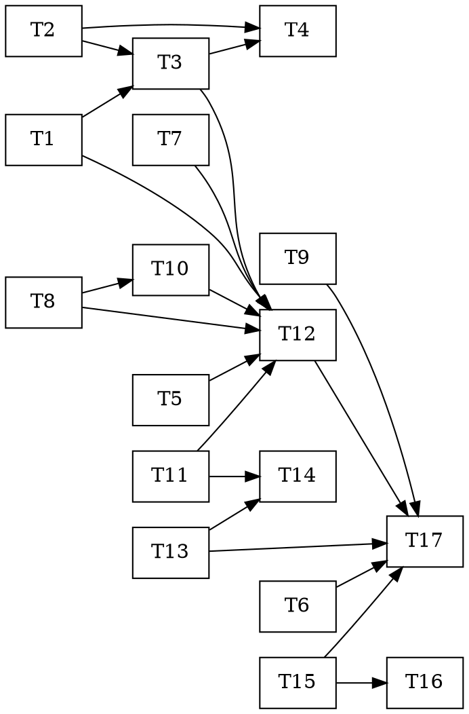

# Phase 3 Layer 3 — Task Dependency Graph

Tasks are defined in [`plan.md`](plan.md). This file is the **dependency graph** so subagents can pick up independent tasks in parallel (CLAUDE.md practice 2). One PR per task (or per batch of tightly-coupled tasks); CI green before merge.

## Dependency edges

```
T1  parse_metric            ── (none)
T2  migration 006 master    ── (none)
T5  worker (worktree)       ── (none)
T6  replay clock            ── (none)
T7  notebook                ── (none)
T8  hindsight_client        ── (none)
T9  vault validator         ── (none)
T11 halt / kill-switch      ── (none)
T13 reporter                ── (none, uses migration cols at runtime only)
T15 seven subagent .md      ── (none)

T3  promote_pipeline        ── needs T1, T2
T4  refresh_master          ── needs T2, T3
T10 roles (P/R/G)           ── needs T8        (Guardian uses gates; Planner uses Hindsight)
T14 telegram                ── needs T11, T13
T16 CI scope guard          ── needs T15
T12 orchestrator            ── needs T1, T3, T5, T7, T8, T10, T11
T17 runner + integ smoke    ── needs T6, T9, T12, T13, T15
```



## Parallel batches (max fan-out per wave)

| Wave | Tasks (run in parallel) | Unblocks |
|---|---|---|
| **1** | T1, T2, T5, T6, T7, T8, T9, T11, T13, T15 | everything |
| **2** | T3 (T1,T2) · T10 (T8) · T16 (T15) | T4, T12 |
| **3** | T4 (T2,T3) · T14 (T11,T13) | — |
| **4** | T12 (T1,T3,T5,T7,T8,T10,T11) | T17 |
| **5** | T17 (T6,T9,T12,T13,T15) | Layer-3 exit |

Wave 1 is 10 independent tasks — the bulk of the build parallelizes. Waves 2–5 are the integration spine.

## Notes for implementers

- **Graceful-offline is mandatory** everywhere: `dsn=None`, `base_url=None`, `token=None` must each make the component a safe no-op (test that path first). The kernel already follows this (`ProvenanceWriter(None)`, `LLMMutator` fallback).
- **DSN-gated tests** (T2, T3, T4) `pytest.skipif(not os.environ.get("MAHORAGA_DSN"))` so the unit suite stays network-free; CI's integration-smoke runs them against a fresh migrated DB.
- **Substrate rule:** nothing under `services/trader/**` imports Hermes/NemoClaw. T15/T16 are the only substrate-coupled artifacts.
- After each merge, tick the matching `[ ]` in plan.md and update `docs/PROGRESS.md` Layer-3 row.
- Exit gate (amendment §7) is verified in T17 + a final unattended-cadence run, not in any single unit task.
