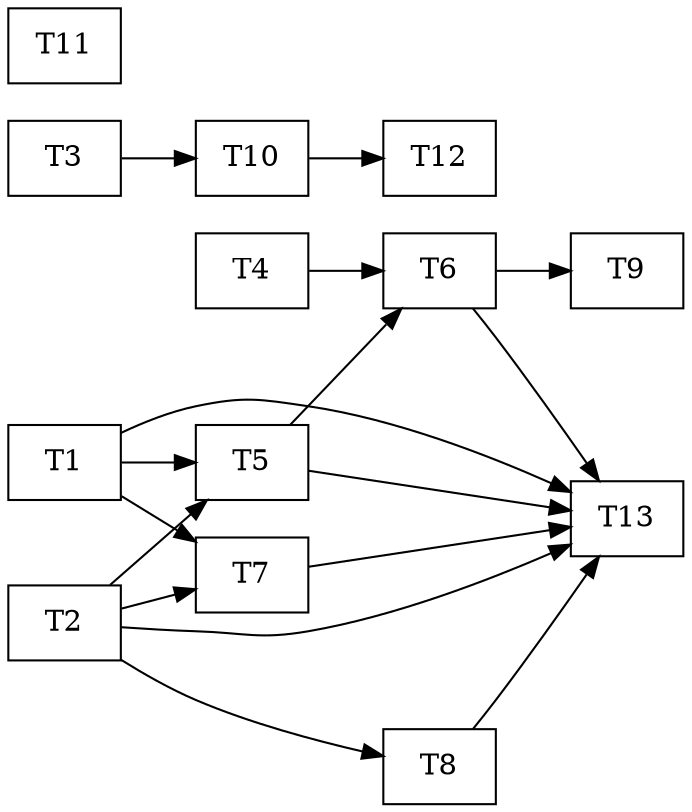

# Phase 4 — Intelligence Layer — Task Dependency Graph

Tasks are defined in [`plan.md`](plan.md). This file is the **dependency graph** so subagents can pick up independent tasks in parallel (CLAUDE.md practice 2). One PR per wave; CI green before merge.

## Dependency edges

```
T1  AlpacaNewsClient        ── (none)
T2  NewsClassifier          ── (none)
T3  macro connectors        ── (none)
T4  MICRO momentum/volume   ── (none)
T11 ArchivistSynthesis      ── (none; Hindsight client exists)

T5  SentimentFeature        ── needs T1, T2
T7  SentimentAggregator     ── needs T1, T2
T8  NewsShockProtocol       ── needs T2   (+ ops.halt, exists)
T10 WebResearcher           ── needs T3   (+ llm, hindsight — exist)

T6  MicroLens               ── needs T4, T5
T12 web-research allowlist  ── needs T10  (+ researcher.md, exists)
T9  TransitionPredictor     ── needs T6

T13 runner + integ smoke    ── needs T1, T2, T5, T6, T7, T8   (full chain)
```



## Parallel batches (max fan-out per wave)

| Wave | Tasks (parallel) | Unblocks |
|---|---|---|
| **1** | T1, T2, T3, T4, T11 | everything |
| **2** | T5 (T1,T2) · T7 (T1,T2) · T8 (T2) · T10 (T3) | T6, T12 |
| **3** | T6 (T4,T5) · T12 (T10) | T9, T13 |
| **4** | T9 (T6) | — |
| **5** | T13 (T1,T2,T5,T6,T7,T8) | Phase-4 exit |

Wave 1 = 5 independent tasks. Wave 2 = 4. The chain narrows through the MICRO lens (T6) into the integration smoke (T13).

## Notes for implementers

- **Graceful-offline is mandatory:** no `ALPACA_API_KEY` / `base_url=None` / `hindsight=None` / `dsn=None` → safe no-op, never stall. Unit tests never touch the network — use the committed fixtures + injected transports.
- **PIT / no look-ahead:** T5 (SentimentFeature) MUST pass a deliberate-leak canary (future-dated news cannot affect a past bar). T4 momentum/volume features use only past bars.
- **Reuse, don't rebuild:** `HaltControl` (T8), `HindsightClient` (T7/T9/T10/T11), `llm.py` synthesis (T10), and the `researcher.md` subagent (T12) already exist from Layer 3 — bind to their real signatures.
- **Substrate rule:** nothing under `services/trader/**` imports Hermes. T12 is the only substrate-coupled artifact.
- After each merge, tick the `[ ]` in plan.md and update `docs/PROGRESS.md` Phase-4 row.
- Alpaca creds live only in the gitignored `.env` (names documented in `.env.example`). Live smokes read them from the environment; never commit a value.
- Exit sign-off (spec §3) is verified in T13 + a live ingest smoke with the key, not in any single unit task.
