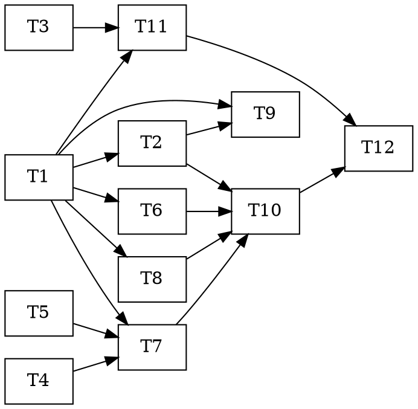

# Phase 5 — Broker + Paper Trading — Task Dependency Graph

Tasks are defined in [`plan.md`](plan.md). This is the **dependency graph** for parallel subagent pickup (CLAUDE.md practice 2). One PR per wave; CI green before merge.

## Dependency edges

```
T1  domain model        ── (none)   [the blocker — everything needs it]
T2  AlpacaBrokerClient   ── needs T1
T3  trades.* migration   ── (none)
T4  ATR + stop util      ── (none)
T5  econ-calendar gate   ── (none)

T6  position sizing      ── needs T1
T7  hard-limit firewall  ── needs T1, T4, T5
T8  compliance engine    ── needs T1
T9  reconciliation       ── needs T1, T2   (+ HaltControl, exists)
T11 trade store          ── needs T1, T3

T10 executor             ── needs T2, T6, T7, T8   (+ HaltControl, exists)
T12 runner + integ smoke ── needs T10, T11
```



## Parallel batches (max fan-out per wave)

| Wave | Tasks (parallel) | Unblocks |
|---|---|---|
| **1** | T1, T3, T4, T5 | everything |
| **2** | T2 (T1) · T6 (T1) · T7 (T1,T4,T5) · T8 (T1) | T9, T10, T11 |
| **3** | T9 (T1,T2) · T11 (T1,T3) | T12 |
| **4** | T10 (T2,T6,T7,T8) | T12 |
| **5** | T12 (T10,T11) | Phase-5 firewall exit |

T1 (the domain model) is the sole Wave-1 blocker for most of Wave 2 — build it first and merge before fanning out Wave 2, OR pass its interface inline to Wave-2 subagents. T3/T4/T5 parallelize alongside T1.

## Notes for implementers

- **SAFETY is the point of this phase.** The firewall is architectural: the executor (T10) calls firewall+compliance BEFORE the broker and submits only approved orders. `AlpacaBrokerClient.submit_order` defaults `dry_run=True` (T2); `Executor.live_orders` defaults False (T10). No task enables live submission. The T10 + T12 tests assert `submit_order` is never called for a rejected intent and only with `dry_run=True` by default — this IS the exit criterion.
- **Paper endpoint only.** `ALPACA_PAPER_ENDPOINT`; a live endpoint is out of scope. Real-capital go-live is a human gate.
- **Graceful-offline:** no key → broker disabled/empty/no-op; no DSN → trade store no-op. Unit tests never touch the network (fixtures + injected transports). `/account` + `/positions` are read-only GETs, safe to smoke live.
- **Kill-switch <10s:** reuse Layer-3 `HaltControl`; the executor checks `is_halted()` first each cycle. `NewsShockProtocol` (Phase 4) already trips it on CRITICAL news; Reconciler (T9) trips it on material discrepancy.
- **Reuse:** `backtest/risk.py` limit logic (T7), `ReleaseCalendar` (T5), `AlpacaNewsClient` auth pattern (T2), `hindsight_client` (T10 decision-context retain), `volatility.py` ATR if present (T4).
- DSN-gated tests (T3, T11) skip locally; CI integration-smoke runs them on a fresh migrated DB.
- After each merge, tick plan.md + update `docs/PROGRESS.md`. The 30-day paper window + Sharpe>1.0 are operational gates AFTER the code merges (Phase-6 monitoring), not unit tasks.
